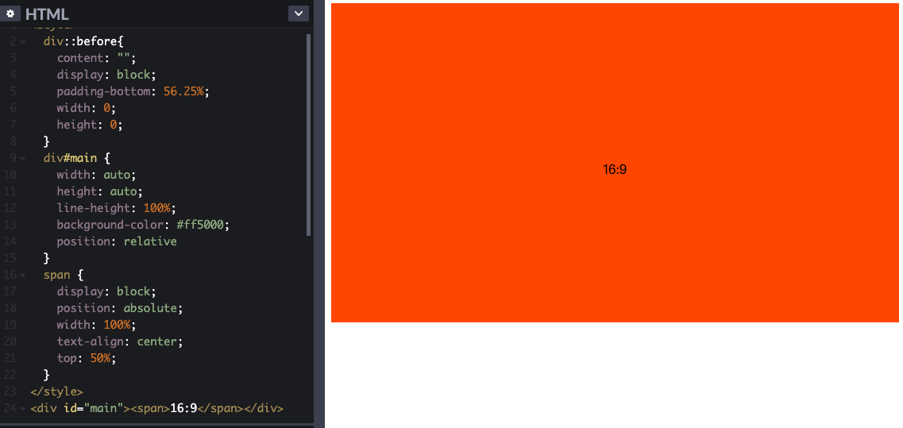

## 手写系列

### 手写防抖

```javascript
function myDebounce(fn,delay) {
  let timer = null
  return (...args) => {
    clearTimeout(timer);
    timer = setTimeout(() => {
      fn.apply(this,args)
    },delay)
  }
}
```

### 手写节流

```javascript
function myThrottle(fn,delay){
    let flag = false
    return (...args) => {
      if(flag) return
      flag = true
      setTimeout(() => {
        fn.apply(this, args)
        flag = false
      },delay)
    }
  }
```

### 手写new

> 1. 新建实例o
>
> 2. 将o的隐式原型指向Object的原型上
>
> 3. 将this指向当前实例o
> 4. 如果构造函数的返回值是对象，那么返回对象；如果不是，返回当前实例o

```javascript
function myNew(fn,...rest){
  const o = Object.create()
  o.__proto__ = fn.prototype
  const result = fn.apply(o,rest)
  return typeof result === 'object' ? result : o;
}
```

### 手写深拷贝

```javascript
// 没有解决循环引用的版本
function myDeepCopy(obj){
  if(typeof obj === 'object') {
    let clone = Array.isArray(obj) ? [] : {}
    for(const key in obj){
      clone[key] = myDeepCopy(obj[key])
    }
    return clone
  } else return obj // 基本类型直接返回即可
}

var obj = {
  a:1,
  b:null,
  c:true,
  d:{},
  e: {
    f: {
      g: 1
    }
  },
  h:[]
}
console.log(myDeepCopy(obj))
// 上边会导致循环引用的问题
// 比如加入这段话
obj.obj = obj
// 那么如何解决循环引用的问题呢，那就是使用hash
// JS里边就用weekMap做弱引用就好（方便垃圾回收）
// 直接用map会因为强引用而部分内存没法释放
function myDeepCopy2(obj, map = new WeakMap()){
  if(typeof obj === 'object'){
    const isArray = Array.isArray(obj) 
    let clone = isArray ? [] : {}
    if(map.get(obj)){
      return map.get(obj)
    }
    map.set(obj, clone)
    for(const key in obj){
      clone[key] = myDeepCopy2(obj[key], map)
    }
    return clone
  }
  else return obj
}

// ------------------------- 进阶 -----------------------//
// 使用while替代for in循环，因for in在遍历时性能十分低下
// 首先封装一个通用的循环遍历函数forEach
// iteratee是遍历的回调函数，他可以接收每次遍历的 value和 index两个参数
function forEach(array, iteratee){
  let index = -1
  const len = array.length
  while(++i < len){
    iteratee(array[index],index)
  }
  return array
}
function myDeepCopy3(obj, map = new WeakMap()){
  if(typeof obj === 'object'){
    const isArray = Array.isArray(obj) 
    let clone = isArray ? [] : {}
    if(map.get(obj)){
      return map.get(obj)
    }
    map.set(obj, clone)
    const keys = isArray? undefined : Object.keys(obj)
    forEach(keys || obj,(value,key) => {
      if(keys) { key = value}
      clone[key] = myDeepCopy3(obj[key], map)
    })
    return clone
  }
  else return obj
}
```

完整版：考虑了除object、array和基本类型之外的其他类型


### 手写原生ajax

核心是依赖XMLHttpRequest

```js
function ajax(url, method, body, success, fail){
  let request = new XMLHttpRequest()
  request.open(method,url)
  request.onreadystatechange = () => {
    if(request.readyState === 4){
      if(request.status >= 200 && request.status < 300){
        success.call(undefined, request.responseText)
      } else {
        fail.call(undefined, request)
      }
    }
  }
  request.send(body)
}
```


### 手写Promise

- [Promise解决的问题](https://segmentfault.com/a/1190000016273587)：解决回调地狱，使得异步过程同步化，简洁代码逻辑（可读性问题）；还有一个是异步回调信任问题，比如回调过早（被当成同步调用）、回调过晚或者没有回调、回调次数过多（如下）。

  > 一个来自[《YDKJS》](https://github.com/getify/You-Dont-Know-JS/blob/master/async & performance/README.md#you-dont-know-js-async--performance)的例子：一个程序员开发了一个付款的系统，它良好的运行了很长时间。突然有一天，一个客户在付款的时候信用卡被连续刷了五次。这名程序员在调查了以后发现，一个第三方的工具库因为某些原因把付款回调执行了五次。在与第三方团队沟通之后问题得到了解决。

- Promise引入的问题：

  - then链过程导致阅读困难
  - 没办法写成同步的写法，没办法用try、catch
  - Promise一旦开始，中途没办法取消

- then收集依赖 -> 异步触发resolve -> resolve执行依赖

- async/await 自动执行、返回Promise的resolve/reject值

  #### Promise.all

  #### Promise.race

  #### Promise.try

  

### 手写发布-订阅模式

```javascript
class EventEmitter{
  constructor(){
    // 事件对象，存储订阅的名字和事件
    this.events = {}
  }
  // 注册事件
  on(eventName,cb){
    // 如果该事件类型不存在，则新建一个队列，存放callback函数
    if(this.events[eventName]) this.events[eventName] = [cb]
    else {
    // 存在则push到指定事件类型的队列中
    this.events[eventName].push(cb)
    }
  }
  // 触发事件
  emit(eventName){
    if(!this.events[eventName].length) return
    else {
      this.events[eventName].map(cb => cb())
    }
    // 写成 this.events[eventName] && this.events[eventName].forEach(cb => cb()) 更快
  }
  // 注销事件
  removeListener(eventName, cb){
    if(this.events[eventName]){
      this.events[eventName] = this.events[eventName].filter(item => item !== cb )
    }
  }
  // 只执行一次订阅时间，然后移除
  once(eventName,cb){
    let fn = () => {
      cb()
      this.removeListener(eventName, cb)
    }
    // 先注册事件，监听到则执行fn，触发回调cb，然后注销事件removeListener
    this.on(eventName, fn)
  }
}
```


### 手写数组去重

**常规方法**

```javascript
var arr=[1,2,3,3,4,5,5,6,6]
var res = []
for(let i=0;i<arr.length;i++){
 if(res.indexOf(arr[i]) === -1) {
   res.push(arr[i])
 }
}
console.log('去重之后的数组 ',res)
```

**ES6**

```javascript
const arr=[1,2,3,3,4,5,5,6,6]
const t = new Set(arr)
[...t]

// 或
const arr=[1,2,3,3,4,5,5,6,6]
Array.from(new Set(arr))

// 或使用正则表达式
// (arr+',').replace(/(\d+,)\1+/ig,'$1') -> "1,2,3,4,5,6,"
// (arr+',').replace(/(\d+,)\1+/ig,'$1').split(',') -> ["1", "2", "3", "4", "5", "6", ""]
(arr+',').replace(/(\d+,)\1+/ig,'$1').split(',').slice(0,-1) // ["1", "2", "3", "4", "5", "6"]
```

### 手写柯里化

```javascript
function curring(fn,...args){
  if(args.length >= fn.length){
    return fn(...args)
  }
  return function(...args2){
    return curring(fn,...args,...args2)
  }
}
```

### 手写reduce

### 手写bind

[JavaScript深入之bind的模拟实现](https://github.com/mqyqingfeng/Blog/issues/12)


### 手写call

1. 将函数设为对象的属性
2. 执行该函数
3. 删除该函数

```javascript
Function.prototype.myCall = function(context=window,...args) {
  context = context || window; // 参数默认值并不会排除null，所以重新赋值
  context.fn = this;
  const res = context.fn(...args)
  delete context.fn;
  return res
}
```


### 手写apply

```js
// apply就是后边放一个数组
Function.prototype.myApply = function(context=window,args=[]) {
  // 如果传入一个类数组，将其转成数组
  if(!Array.isArray(args)) args = [].slice.call(args)
  context = context || window; // 参数默认值并不会排除null，所以重新赋值
  context.fn = this;
  const res = context.fn(...args)
  delete context.fn;
  return res
}
```


### 手写Map（不是map）

[引自](http://www.fly63.com/article/detial/6582)

虾皮一面的蛮有趣的一道题，我当时没做出来！

Map利用链表，hash的思想来实现。用obj来存储map的属性名和属性值，这样就可以实现map的key可以是任意数据类型啦~~~

```javascript
function Mymap() {  //构造函数
    this.init();
}

//初始化函数，创建桶（数组），每个位置都是一个对象，每个对象的属性上设置next属性，并且初始化为null。
Mymap.prototype.init = function () {  
    this.tong = new Array(8);
    for (var i = 0; i < 8; i++) {
        this.tong[i] = new Object();
        this.tong[i].next = null;
    }
};
//添加数据。
Mymap.prototype.set = function (key, value) {
    var index = this.hash(key);        //获取到当前设置的key设置到那个位置上
    var TempBucket = this.tong[index]; //获取当前位置的对象
    while (TempBucket.next) {          //遍历如果当前对象链接的下一个不为空
        if (TempBucket.next.key == key) {  //如果要设置的属性已经存在，覆盖其值。
            TempBucket.next.value = value;
            return;                          //return ,不在继续遍历
        } else {
            TempBucket = TempBucket.next;  //把指针指向下一个对象。
        }

    }
    TempBucket.next = {  //对象的next是null ,添加对象。
        key: key,
        value: value,
        next: null
    }
};

//查询数据
Mymap.prototype.get = function (key) {
    var index = this.hash(key);
    var TempBucket = this.tong[index];
    while(TempBucket){
        if(TempBucket.key == key){
            return TempBucket.value;
        }else{
            TempBucket = TempBucket.next;
        }
    }
    return undefined;
}

//删除数据
Mymap.prototype.delete = function(key){
    var index = this.hash(key);
    var TempBucket = this.tong[index];
    while(TempBucket){
        if(TempBucket.next.key == key){
            TempBucket.next = TempBucket.next.next;
            return true;
        }else{
            TempBucket = TempBucket.next;
        }
    }
}
//看当前属性是否存在
Mymap.prototype.has = function(key){
    var index = this.hash(key);
    var TempBucket = this.tong[index];
    while(TempBucket){
        if(TempBucket.key == key){
            return true;
        }else{
            TempBucket = TempBucket.next;
        }
    }
    return false;
}
//清空这个map
Mymap.prototype.clear = function(){
    this.init();
}
//使设置的属性平均分配到每个位置上，使得不会某个链条过长。
Mymap.prototype.hash = function (key) {
    var index = 0;
    if (typeof key == "string") {
        for (var i = 0; i < 3; i++) {
            index = index + isNaN(key.charCodeAt(i)) ? 0 : key.charCodeAt(i);
        }
    }
    else if (typeof key == 'object') {
        index = 0;
    }
    else if (typeof key == 'number') {
        index = isNaN(key) ? 7 : key;
    } else {
        index = 1;
    }

    return index % 8;
}

var map = new Mymap();    //使用构造函数的方式实例化map
var a = {}
var b = {name:'leo'}
var o = {}
o[a] = 'a'
console.log(o[b]) // 'a'，因为obj的key值都是字符串
map.set(a,'map的a')
console.log(map.get(a)) // 'map的a'
console.log(map.get(b)) // undefined，map可以存储任意类型

```


### JS实现堆

包括插入和删除元素函数的实现


### JS实现链表

新增、插入、删除


# 2021-03-16

## transform问题

### 会引起重排吗？

不会。因为transform开启了复合图层，不会影响默认复合图层（普通文档流），所以不会影响周边DOM结构，也就不会发生重排。

### transform缺点

1. 会使子元素fixed定位和absulote定位失效；
2. 父元素设置border-radius和overflow:hidden，子元素有transform属性，那么父元素设置无效，还是直角边框；父元素添加属性`-webkit-transform:rotate(0deg)`可以解决。
3. 影响z-index
4. 影响fixed定位。fixed定位基于视窗定位。如果对固定定位元素的父元素设置transform为none，固定定位元素的表现可能退化为absolute定位。


## 箭头函数

- 特点：

  - 书写优雅：不需要写function关键字、省略return关键字

  - 拿到上一层封闭上下文作用域的this，不会有普通函数this可能跟直觉不一致或者在严格模式下没有this的问题 。箭头函数的this永远指向上下文的this，call、apply、bind也无法改变。

  - 不存在arguments对象。如果要用，可以用rest参数代替

    ```js
    (...args) => {}
    ```

  - 没有prototype属性（即没有原型对象）

    ```js
    var foo  = () => {}
    var bar = function(){}
    console.log(foo.prototype) // undefinded
    console.log(bar.prototype) // {constructor: ƒ}
    ```

  - 不可以使用yield命令

  - 不能作为构造函数

    ```js
    var foo  = () => {}
    var newFoo = new foo() // foo is not a constructor
    ```

    

## 脚本异步加载

defer、 async

```html
<script src="path/to/myModule.js" defer></script>
<script src="path/to/myModule.js" async></script>
```

上面代码中，`<script>`标签打开`defer`或`async`属性，脚本就会异步加载。渲染引擎遇到这一行命令，就会**开始下载外部脚本，但不会等它下载和执行**，而是直接执行后面的命令。

**`defer`与`async`的区别**是：`defer`要等到整个页面在内存中正常渲染结束（DOM 结构完全生成，以及其他脚本执行完成），才会执行；`async`一旦下载完，渲染引擎就会中断渲染，执行这个脚本以后，再继续渲染。一句话，`defer`是“渲染完再执行”，`async`是“下载完就执行”。另外，如果有**多个`defer`脚本，会按照它们在页面出现的顺序加载**，而**多个`async`脚本是不能保证加载顺序**的。


ES6的type="module"

```html
<script type="module" src="./foo.js"></script>
<!-- 等同于 -->
<script type="module" src="./foo.js" defer></script>
```

使用type="module"等同打开了defer。但是**如果写了async，那么就按照async去表现**，即只要加载完成，渲染引擎就会中断渲染、执行该js脚本，等执行完成之后再接着渲染。一旦使用了`async`属性，`<script type="module">`就不会按照在页面出现的顺序执行，而是只要该模块加载完成，就执行该模块。

```html
<script type="module" src="./foo.js" async></script>
```

对于外部模块脚本，有以下特点：

1. 代码是在模块作用域内运行，不是在全局作用域运行。模块内部的顶层变量，外部不可见；

2. 模块脚本自动采用严格模式，不管有没有声明use strict

3. 模块之中，可以使用import加载其他模块（.js后缀不能省略、需要提供绝对URL或相对URL）、也可以使用export输出对外接口；

4. 模块之中，顶层this关键字返回undefined，而不是指向window，也就是说在模块顶层使用this关键字，是无意义的

5. 同一个模块如果加载多次，将只执行一次

   ```js
   // 某个模块内部
   import utils from 'https://example.com/js/utils.js';
   const x = 1;
   console.log(x === window.x); //false
   console.log(this === undefined); // true
   ```


## 遍历对象方法对比

- for in

  遍历自身、也遍历原型链上的继承的属性

- Object.keys(obj)

  遍历自身可枚举的字符串属性

- Reflect.ownKeys(obj)
  返回一个数组，包括自身可枚举、不可枚举、Symbol的属性、不包含原型链继承的属性

- Object.getOwnPropertyNames(obj)
  返回一个数组，包括自身可枚举、不可枚举的属性，不包含Symbol、不包含原型链继承的属性

```js
// 创建一个对象并指定其原型，bar 为原型上的属性
// baz 为对象自身的属性并且不可枚举
var obj = Object.create({
  bar: 'bar'
}, {
  baz: {
    value: 'baz',
    enumerable: false
  }
})
// obj自身属性foo
obj.foo = 'foo'
// 给对象添加一个不可枚举的 Symbol 属性
Object.defineProperties(obj, {
  [Symbol('baz')]: {
    value: 'Symbol baz',
    enumerable: false
  }
})
// 不包括不可枚举的 baz 属性
Object.keys(obj).forEach((key) => {
  console.log(obj[key]) // foo
})
// 包括不可枚举的 baz 属性
Object.getOwnPropertyNames(obj).forEach((key) => {
  console.log(obj[key]) // baz, foo
})
// 返回对象自身的 Symbol 属性组成的数组，不包括字符串属性
Object.getOwnPropertySymbols(obj).forEach((key) => {
  console.log(obj[key]) // Symbol baz
})
// 给对象添加一个可枚举的 Symbol 属性
obj[Symbol('foo')] = 'Symbol foo'
// 不管Symbol可否枚举，都能遍历出
Object.getOwnPropertySymbols(obj).forEach((key) => {
  console.log(obj[key]) // Symbol baz, Symbol foo
})
// 包括不可枚举的属性和 Symbol 属性
Reflect.ownKeys(obj).forEach((key) => {
  console.log(obj[key]) // baz, foo, Symbol baz, Symbol foo
})
```


# 2021-03-15

## Axios、fetch

- Axios

  - Axios 是一个基于 promise 的 HTTP 库，可以用在浏览器和 node.js 中。

  - [注意事项](https://zhuanlan.zhihu.com/p/58837269)

    1. 使用GET方法传参使用`params`，POST、PUT、PATCH等方法使用对应的传参使用的是 `data`，data是作为 **请求体** 发送的。

    2. `axios` 中 `POST` 的默认请求体类型为 `Content-Type:application/json`（JSON 规范流行），这也是最常见的请求体类型，也就是说使用的是序列化后的 `json` 格式字符串来传递参数，如： `{ "name" : "mike", "sex" : "male" }`；同时，后台必须要以支持 `@RequestBody` 的形式来接收参数，否则会出现前台传参正确，后台不接收的情况。如果想要设置类型为 `Content-Type:application/x-www-form-urlencoded`（浏览器原生支持），可以用 `qs` 这个库来格式化数据，默认情况下在安装完 `axios` 后就可以使用 `qs` 库；也可以使用 `URLSearchParams`，但并不是所有浏览器都支持 `URLSearchParams。

       > - `plain object`（纯对象）：是指 `JSON` 形式定义的普通对象或者 `new Object()` 创建的简单对象；
       > - `URLSearchParams object`：指的是一个可以由 [URLSearchParams](https://link.zhihu.com/?target=https%3A//developer.mozilla.org/zh-CN/docs/Web/API/URLSearchParams) 接口定义的一些实用方法来处理 URL 的查询字符串的对象，也就是说 `params` 传参是以 `/user?ID=1&name=mike&sex=male` 形式传递的。

- fetch


## 上传文件进度显示

- 借助XMLHttpRequest的progress事件，这个事件会返回文件已上传的大小和总大小，根据这两个值，就可以计算上传进度了，关于这个方法，在《Javascript高级程序设计(第3版)》21章第3节中有叙述：

  ```js
  var xhr = new XMLHttpRequest()
  xhr.onload = (event) => {
    if(xhr.status >=200 && xhr.status < 300 || xhr.status === 304) alert(xhr.responseText)
    else alert('请求未成功，',xhr.responseText)
  }
  xhr.onprogress = (event) => {
    let divStatus = document.getElementById("progressBar")
    // 如果响应头有Content-Length字段
    if (e.lengthComputable) {
          progressBar.max = e.total;
          progressBar.value = e.loaded;
      }
  }
  ```
  进度条使用h5的progress标签
  
  ```html
   <progress id="progressBar" value="0" max="100"></progress>
  ```
  
  


## 大文件断点续传

(字节面试官：请你实现一个大文件上传和断点续传)[https://cloud.tencent.com/developer/article/1586374]

**>>>>> 法1：**

首先，前端对大文件进行切片，核心是借助Blob.peototype.slice这个方法，返回原文件的某个切片。

之后，根据预先设置好的切片最大数量将文件分割成一个个切片，借助http的并发性，同时上传多个切片；由于并发上传，需要给切片记录顺序；

再之后，服务端接收切片，等接收完成，合并、还原成原本的文件。

**>>>>> 法2:**

参考http://www.zuidaima.com/blog/2819949848316928.htm

首先，处理前端上传环节：

1. 通过减少文件体积，减少上传流量来优化
2. 通过合并小文件，减少请求数来优化

所以有以下几种方法：

- 图片上传压缩
- zip合并小文件
- sprite雪碧图
- 直接合并内容

> 不需要采用ZIP或者SPRIT方式合并文件，把文件读取出 arraybuffer 后是直接可以连接在一起的，之后还可以再次转成 blob 发送到服务端，或者直接发送 arraybuffer，理论上性能应该比SPRITE方案靠谱

- 上传过程优化：

并发上传、分块上传、断点续传

- 算法优化：

  小文件优先处理，减少用户等待时间

> 因为第一个文件的验证等待无法避免，如果第一个文件处理的文件越小，是不是等待的时间就越短？所以把队列中最小的一个文件放到第一个优先处理可以进一步减少用户等待时间

  验证过程提前到当前文件的传输期

> 如果当前文件已经在传输了，这个时候，用户是处于等待状态，机器也处于等待期，如果把下一个文件的验证过程移至此过程，那么用户的等待 MD5 的时间和等待当前文件传输完成的时间就重合了。这样用户就只需要等待第一个文件的验证过程。

  更换序列化算法，取段MD5

> 其实对于某些二进制文件，如JPEG，前面一段数据记录了很多此图片的信息，比如：拍摄时间，相机名称，图片尺寸，图片旋转度等等，直接 MD5 这一段数据基本上就可以保证此文件的唯一性了。只要取段的总大小小于10M，再大的文件也能在1秒内完成序列号工作。


## 判断是不是手机靓号

```js
// 首先判断是不是手机号码，正则表达式，一搜就有。
// 靓号的规则是4个连续相同的数或者4个连续升序的数
function niceNumber(str){
  let pre=0,count=0
  const len = str.length
  for(let i=1;i<len;i++){
    // 判断连续4个相同
    if(str[pre] !== str[i]){
      count = 0
      pre = i}
    else {
      count++
      if(count === 3) return true}
    if(pre>=len-3) break
  }
  // 判断是否有连续升序
  count = 0
  pre=0
  for(let i=1;i<len;i++){
    if(str[i]>str[pre]){
      count++
      if(count === 3)return true
    } else {
      count = 0
    }
    pre++
  }
  return false
}
var str = '15601234567'
niceNumber(str) // true
var str2 = '156010101010'
niceNumber(str2) // false
```


# 2021-03-14

## 剩余参数与arguments对象的区别

[摘自MDN](https://developer.mozilla.org/zh-CN/docs/Web/JavaScript/Reference/Functions/Rest_parameters)

> 剩余参数和 `arguments`对象之间的区别主要有三个：
>
> - 剩余参数只包含那些没有对应形参的实参，而 `arguments` 对象包含了传给函数的所有实参。
> - `arguments`对象不是一个真正的数组，而剩余参数是真正的 `Array`实例，也就是说你能够在它上面直接使用所有的数组方法，比如 `sort`，`map`，`forEach`或`pop`。
> - `arguments`对象还有一些附加的属性 （如`callee`属性）。


## iframe

- **HTML内联框架元素**，它能够将另一个HTML页面嵌入到当前页面中。
- iframe里边触发的事件不能传播到iframe外来，解决方案：对iframe元素监听（如果iframe元素里边没做冒泡拦截之类的）、内外通讯（根据具体业务来吧）


## 转驼峰

```javascript
function camelize(str){
  // 增加对下划线的处理，不仅仅是^a-zA-Z0-9
  return str.replace(/[\W|\_]+(.)/g, (match,chr) => {
    return chr.toUpperCase()
  })
}
console.log(camelize('Bar char')) // 'BarChar'

// 高级点
function camelize(str) {
  return str.replace(/(?:^\w|[A-Z]|\b\w)/g, function(word, index) {
    return index === 0 ? word.toLowerCase() : word.toUpperCase();
  }).replace(/\s+/g, '');
}

camelize("EquipmentClass name");
camelize("Equipment className");
camelize("equipment class name");
camelize("Equipment Class Name"); // 均为"equipmentClassName"

// 也可以
function camelize(str) {
  // 增加对下划线的处理 'Li_Sha' -> 'liSha' 
  str = str.replace(/\_+/g,'')
  return str.replace(/(?:^\w|[A-Z]|\b\w|\s+)/g, function(match, index) {
    if (+match === 0) return ""; // or if (/\s+/.test(match)) for white spaces
    return index === 0 ? match.toLowerCase() : match.toUpperCase();
  });
}
camelize('   Leo Ha ha') // "LeoHaHa"
camelize('L   Leo Ha ha') // "lLeoHaHa"

// 使用lodash的camelCase()
_.camelCase('__FOO_BAR__');
// → 'fooBar'

```


## 尾调用

在ES6规范中，有一个尾调用优化，可以实现高效的尾递归方案。一句话，就是指某个函数的最后一步是调用另一个函数。ES6的尾调用优化只在严格模式下开启，正常模式是无效的。

```javascript
'use strict'
// 尾调用的斐波那契数列
function fib(n, current = 0, next = 1) {
    if(n == 0) return 0;
    if(n == 1) return next; // return next
    console.log(`fibonacci(${n}, ${next}, ${current + next})`);
    return fib(n - 1, next, current + next);
}
```

在ES6中，strict模式下，满足以下条件，尾调用优化会开启，此时引擎不会创建一个新的栈帧，而是清除当前栈帧的数据并复用：

- 尾调用函数不需要访问当前栈帧中的变量；
- 尾调用返回后，函数没有语句需要继续执行；
- 尾调用的结果就是函数的返回值；

ES6的尾调用优化只在严格模式下开启，正常模式是无效的。
这是因为在正常模式下，函数内部有两个变量，可以跟踪函数的调用栈。

> arguments：返回调用时函数的参数。
> func.caller：返回调用当前函数的那个函数。

尾调用优化发生时，函数的调用栈会改写，因此上面两个变量就会失真。严格模式禁用这两个变量，所以尾调用模式仅在严格模式下生效。

如果尾调用自身，就称为**尾递归**。尾递归的实现，往往需要改写递归函数，确保最后一步只调用自身。做到这一点的方法，就是把所有用到的内部变量改写成函数的参数。

```javascript
// 实现阶乘 复杂度 O(n)
function factorial(n) {
  if (n === 1) return 1;
  return n * factorial(n - 1);
}

// 尾递归 只保留一个调用帧，复杂度 O(1) 
function factorial(n, total = 1) {
  if (n === 1) return total;
  return factorial(n - 1, n * total);
}
```


## 跨域时GET、POST的区别

GET产生一次TCP数据包、POST产生两次（一次预检请求、一次真正发起）

对于GET方式的请求，浏览器会把http header和data一并发送出去，服务器响应200（返回数据）；
而对于POST，浏览器先发送header，服务器响应100 continue，浏览器再发送data，服务器响应200 ok（返回数据）。


## async/await

#### 两个（多个）await并行

使用Promise.all

```javascript
async function doit() {
  var list = [];


  list.push(sayHello('a1'))
  list.push(sayHello('a2'));
  // 并行处理
  var result = await Promise.all(list);
  console.log(result);
  console.log('over')
}

async function sayHello(name) {
  await new Promise(function (resolve) {
    setTimeout(function () {
      console.log(name + new Date());
      resolve(name);
    }, 1000)
  })
}

doit();
// a1Sun Mar 14 2021 19:54:16 GMT+0800 (中国标准时间)
// a2Sun Mar 14 2021 19:54:16 GMT+0800 (中国标准时间)
// over
```

#### await循环

foreach中使用await (结论：不可用)

```javascript
(async ()=>{
  // 抽象一个函数 等待相应的时候后返回成功状态，如果小于0为失败状态
  let waitFun = function (time) {
    return new Promise((resolve, reject)=>{
      if(time>0){
        setTimeout(()=>{
          resolve(time)
        },time)
      }else {
        reject('执行失败')
      }
    })
  }
  //-----------------------------------------------------------------------------------------------------------------------------
  let list = [{waitTime:3000},{waitTime:2000},{waitTime:1000}];
  console.time('total time')
  list.forEach( async (item)=>{
    console.log('输出结果:',await waitFun(item.waitTime))
  });
  console.timeEnd('total time')

  /**
    * total time: 0.610107421875ms
    * 输出结果: 1000
    * 输出结果: 2000
    * 输出结果: 3000
    */
  let promiseList = [waitFun(3000),waitFun(2000),waitFun(1000),];    
  console.time('total time')
  promiseList.forEach( async (item)=>{
    console.log('输出结果:',await item)
  });
  console.timeEnd('total time')
  // 输出结果同上，完全没停住
})()
```


for循环

```javascript
(async ()=>{
  // 抽象一个函数 等待相应的时候后返回成功状态，如果小于0为失败状态
  let waitFun = function (time) {
    return new Promise((resolve, reject)=>{
      if(time>0){
        setTimeout(()=>{
          resolve(time)
        },time)
      }else {
        reject('执行失败')
      }
    })
  }
  //-----------------------------------------------------------------------------------------------------------------------------
let list = [{waitTime:3000},{waitTime:2000},{waitTime:1000}];
let promiseList = [waitFun(3000),waitFun(2000),waitFun(1000),];
console.time('total time')
    for(let i = 0;i<list.length;i++){
        console.log('输出结果:',await waitFun(list[i].waitTime))
    }
console.timeEnd('total time')
// 停了！
  
// 使用 promise 循环如下
for(let i = 0;i<promiseList.length;i++){
    console.log('输出结果:',await promiseList[i]);
}
// 没停
})()
```


# 2021-03-13

## base64

- 是什么： 一种编码方式，二进制文件流转字符串

- 弊端：

  并不是说转base64编码后比原图大，而是因为内联在HTML/CSS中造成体积变大从而**影响网页打开速度**。如果使用外链图片的话，图片可以在页面渲染完成之后继续加载，不会造成阻塞

  如果 base64 是被编码到 css/js 中，是可以缓存的，因为 css/js 文件可以缓存。（base64 **无法缓存**，要缓存只能缓存包含 base64 的文件，比如 HTML 或者 CSS，这相比直接缓存图片要弱很多，一般 HTML 会改动频繁，所以等同于得不到缓存效益）

  使用 base64 的另外一个弊端是 **IE 的兼容性问题**。IE 8 以下不支持 data url，IE 8 开始支持 data url，却有大小限制，32k（未测试）

  还有一个问题是，如果构建工具比较落后（或者没有构建工具），手动插入 base64 是很蛋疼的，编辑器会卡到哭。

- 优点：内联是优势，不再发一次请求资源；无跨域问题
- 适用场景：小图标


## 去除字符串头尾空白字符

```javascript
// 法1 正则
'   sss   '.replace(/\s+/g,'')

// 法2 trimStart\trimEnd
function trim(str){
  str = str.trimStart()
  return str.trimEnd() 
}

// 法3 我tm直接调用函数
function myTrim(str){
  if(typeof str !== 'string') return 
  return str.trim()
}
```

## 蛮有意思的虾皮的面试题

```javascript
// 字符串按空格反转（I LOVE SHOPEE => I EVOL EEPOHS）
function reverseString(str) {
  return str.split('').reverse().join('')}
function test(str) {
  let arr = str.split(' ')
  let len = arr.length
  let res = ''
  for(let i=0;i<len;i++){
    res = res + reverseString(arr[i]) + ' '
  }
  return res.trimEnd()
}
console.log(test('I LOVE SHOPEE')) // I EVOL EEPOHS

// 链表按空格反转（I->' '->L->O->V->E->' '->S->H->O->P->E->E => I->' '->E->V->O->L->' '->E->E->P->O->H->S）
// 其实上一步的方法是本步骤的基础，可以先将I LOVE SHOPEE => I EVOL EEPOHS，然后利用结果字符串生成链表
// 面试官好坏哦，谜底又在谜面上~
// 这是我想的，不知道正确答案；不知道原地反转能不能行
class LinkedList{
  constructor(){
    this.length = 0
    this.head = null
  }
  var Node = function(element){
    this.element = element
    this.next = null
  }
}
```


# 2021-03-12

## 缓存

资源永久缓存

资源请求最快的就是不向服务器发起请求。

```http
Cache-Control： max-age=31536000
```

1. 静态资源带hash
2. 对资源设置一年的过期时间（31536000），一般认为永不过期


以下代码输出什么？

```javascript
var a = {}
var b = {}
a[b] = 3
// 将 b 转化为字符串，即 ({}).toString()，由于 b 是对象，应该返回 [object type]，而这里 type 是 Object，所以最终返回 { '[object Object]': 3 }
console.log(a) // {[object Object]: 3}

var a = {}
var b = 2
a[b] = 3
console.log(a) // { 2: 3 }

var a = {}
var b = [1,2] 
a[b] = 3
console.log(a) // { '1,2': 3 }

var a = {}
var b = []
a[b] = 3
console.log(a) // { '': 3 }

var a = {}
var b = []
a.b= 3 // b会被转成字符串
console.log(a) // { b : 3 }
```

this指向问题

```javascript
var a = 10
var obj = {
  a: 20,
  say: () => {
    console.log(this.a)
  }
}
obj.say() // 10
var anotherObj = { a:30 }
obj.say.apply(anotherObj) // 10，不是30哦
```


# 2021-03-05

算2个骰子各扔1次，总和为9的概率

```javascript
function getProbability(n,sum){
  const total = Math.pow(6,n)
  let count = 0 
  for(let i=1;i<7;i++){
    if(sum - i !== i && sum - i <=6) count++
  }
  console.log(`符合的次数${count}，总次数${total}`)
  return count/total
}
```


# 2021-03-04

## Js判断数组的方法

- 使用instanceof 是不好的

  ```javascript
  const a = [];
  const b = {};
  console.log(a instanceof Array);//true
  console.log(a instanceof Object);//true,在数组的原型链上也能找到Object构造函数
  console.log(b instanceof Array);//false
  ```

- 使用constructor也是不好的，因为constructor可以被重新指向

  ```javascript
  //定义一个数组
  const a = [];
  //作死将constructor属性改成了别的
  a.contrtuctor = Object;
  console.log(a.constructor == Array);//false (哭脸)
  console.log(a.constructor == Object);//true (哭脸)
  console.log(a instanceof Array);//true (instanceof火眼金睛)
  ```

- 使用Object.prototype.toString.call：可以，但是有风险

  ```javascript
  const isArray = (something)=>{
      return Object.prototype.toString.call(something) === '[object Array]';
  }
  
  cosnt a = [];
  const b = {};
  isArray(a);//true
  isArray(b);//false
  ```

- 使用Array.isArray：最安全，但是有兼容性问题。给个polyfill：

  ```javascript
  if(!Array.isArray){
      Array.isArray = function(arg){
          return Object.prototype.toString.call(arg)==='[object Array]'
      }
  }
  ```

  


## interface和type的区别

- 相同点：都可以声明类型、都支持拓展

- 区别：

  - type可以而interface不行

    - type可以声明基本类型的别名、联合类型、元组等类型
    - type 语句中还可以使用 typeof 获取实例的 类型进行赋值

  - interface可以而type不行

    - interface 能够声明合并

      ```javascript
      interface User {
        name: string
        age: number
      }
      
      interface User {
        sex: string
      }
      
      /*
      User 接口为 {
        name: string
        age: number
        sex: string 
      }
      */
      ```

- 其他

  参考[这里](https://juejin.cn/post/6844904114925600776)


# 2021-03-03

## history模式和hash模式

history是H5提供的新模式

## SSR

其实就是在服务端安装React、Vue等框架，借助框架的渲染能力输出相关html。不推荐，因为服务器渲染资源宝贵，不过确实能提高首屏加载速度和SEO

```javascript
// app.js
const Vue = require('vue')

module.exports = function createApp (context) {
  return new Vue({
    data: {
      url: context.url
    },
    template: `<div>访问的 URL 是： {{ url }}</div>`
  })
}

// server.js
const createApp = require('./app')

server.get('*', (req, res) => {
  const context = { url: req.url }
  const app = createApp(context)

  renderer.renderToString(app, (err, html) => {
    // 处理错误……
    res.end(html)
  })
})
```


# 2021-03-01

## requestAnimationFrame

与setTimeout相比，`requestAnimationFrame`最大的优势是**由系统来决定回调函数的执行时机。**（[来源](https://juejin.cn/post/6844903649366245384)）

requestAnimationFrame原理如下：

- 注册回调函数
- 浏览器更新时触发 animate
- animate 会触发所有注册过的 callback

requestAnimation的工作机制可以理解为所有权的转移，它把触发帧更新的时间所有权转交给浏览器内核，与浏览器的更新保持同步。这样既可以避免浏览器更新与动画帧更新不同步，又可以基于浏览器足够大的优化空间。

> 首先要明白，**`setTimeout`的执行只是在内存中对图像属性进行改变，这个变化必须要等到屏幕下次刷新时才会被更新到屏幕上**。如果两者的步调不一致，就可能会导致中间某一帧的操作被跨越过去，而直接更新下一帧的图像。假设屏幕每隔16.7ms刷新一次，而`setTimeout`每隔10ms设置图像向左移动1px， 就会出现如下绘制过程：
>
> - 第0ms: 屏幕未刷新，等待中，`setTimeout`也未执行，等待中；
> - 第10ms: 屏幕未刷新，等待中，`setTimeout`开始执行并设置图像属性left=1px；
> - 第16.7ms: 屏幕开始刷新，屏幕上的图像向左移动了**1px**， `setTimeout `未执行，继续等待中；
> - 第20ms: 屏幕未刷新，等待中，`setTimeout`开始执行并设置left=2px;
> - 第30ms: 屏幕未刷新，等待中，`setTimeout`开始执行并设置left=3px;
> - 第33.4ms: 屏幕开始刷新，屏幕上的图像向左移动了**3px**， `setTimeout`未执行，继续等待中；
> - …
>
> 从上面的绘制过程中可以看出，屏幕没有更新left=2px的那一帧画面，图像直接从1px的位置跳到了3px的的位置，这就是丢帧现象，这种现象就会引起动画卡顿。

```
// polyfill
if (!Date.now)
    Date.now = function() { return new Date().getTime(); };
 
(function() {
    'use strict';
     
    var vendors = ['webkit', 'moz'];
    for (var i = 0; i < vendors.length && !window.requestAnimationFrame; ++i) {
        var vp = vendors[i];
        window.requestAnimationFrame = window[vp+'RequestAnimationFrame'];
        window.cancelAnimationFrame = (window[vp+'CancelAnimationFrame']
                                   || window[vp+'CancelRequestAnimationFrame']);
    }
    if (/iP(ad|hone|od).*OS 6/.test(window.navigator.userAgent) // iOS6 is buggy
        || !window.requestAnimationFrame || !window.cancelAnimationFrame) {
        var lastTime = 0;
        window.requestAnimationFrame = function(callback) {
            var now = Date.now();
            var nextTime = Math.max(lastTime + 16, now);
            return setTimeout(function() { callback(lastTime = nextTime); },
                              nextTime - now);
        };
        window.cancelAnimationFrame = clearTimeout;
    }
}());

```


# 2021-02-28

## [JavaScript--排序算法的可视化动画](https://www.jianshu.com/p/342f9b286b83)


## 木头切割问题

> 给定长度为n的数组，每个元素代表一个木头的长度，木头可以任意截断，从这堆木头中截出至少k个相同长度为m的木块。已知k，求max(m)。
>
> 输入两行，第一行n, k，第二行为数组序列。输出最大值。
>
> 
>
> ps:数据保证有解，即结果至少是1。

```javascript
// 我自己写的
function findMax(n,k,arr){
  // 升序啊！！
    arr = arr.sort((a,b) => b-a)
    let count = 0
    let curDivide = arr[0] // 如果结果存在，一定是在[1,max]之间
    while(curDivide > 0){
      for(let i=0;i<n;i++){
        count += Math.floor(item/curDivide)
        if(count === 0) break
      }
      if(count >=k) return curDivide
      else {
        count = 0
        curDivide--
      }
    }
    return -1 // 找不到
}

// 使用二分查找改进
function findMax(n,k,arr){
  // 升序啊！！
    arr = arr.sort((a,b) => b-a)
    let left = 1
    let right = arr[0] // 如果结果存在，一定是在[1,max]之间
    while(left < right){
      const mid = (left+right+1) >> 1
      if(helper(mid,n,arr) >=k) left = mid
      else right = mid - 1 
    }
    return left
}
function helper(mid,n,arr){
  let count = 0
  for(let i=0;i<n;i++){
    count += Math.floor(arr[i]/mid)
    if(count === 0) break
  }
  return count
}
```


## 大数相加问题

## 大数相乘问题

## 实现一个异步调度器Scheduler

> JS实现一个带并发限制的异步调度器Scheduler，保证同时运行的任务最多有两个。完善代码中Scheduler类，使得以下程序能正确输出。
>
> ```javascript
> class Scheduler{
>   add(promiseCreator) { ... }   // ...
> }
> const timeout = (time) => new Promise(resolve => {
>   setTimeout(resolve, time)
> })
> const scheduler = new Scheduler()
> const addTask = (time, order) => {
>   scheduler.add(() => timeout(time)).then(() => console.log(order))
> }
> addTask(1000, '1')
> addTask(500, '2')
> addTask(300, '3')
> addTask(400, '4')
> // output: 2 3 1 4
> // 一开始，1、2两个任务进入队列
> // 500ms时，2完成，输出2，任务3进队
> // 800ms时，3完成，输出3，任务4进队
> // 1000ms时，1完成，输出1
> // 1200ms时，4完成，输出4
> ```

```javascript
class Scheduler{
  constructor(){
    this.taskList = []
    this.count = 0
  }
  add(promiseCreator) {
    return new Promise((resolve,reject) => {
      this.taskList.push({promiseCreator,resolve})
      this.run()
    })
  }
  run(){
    if(this.taskList.length && this.count<2){
      this.count++
      let {promiseCreator, resolve} = this.taskList.shift()
      Promise.resolve(promiseCreator()).then(() => {
        resolve()
        this.count--
        this.run()
      })
    }
  }
}
const timeout = (time) => new Promise(resolve => {
  setTimeout(resolve, time)
})
const scheduler = new Scheduler()
const addTask = (time, order) => {
  scheduler.add(() => timeout(time)).then(() => console.log(order))
}
addTask(1000, '1')
addTask(500, '2')
addTask(300, '3')
addTask(400, '4')
```


# 2021-02-27

## 鼠标点击页面出现爱心特效

只需要直接把这段代码复制到<script></script>标签下运行就可以实现

```javascript
// 鼠标点击出现爱心特效
(function(window,document,undefined){
  var hearts = [];
  window.requestAnimationFrame = (function(){
    return window.requestAnimationFrame ||
      window.webkitRequestAnimationFrame ||
      window.mozRequestAnimationFrame ||
      window.oRequestAnimationFrame ||
      window.msRequestAnimationFrame ||
      function (callback){
      setTimeout(callback,1000/60);
    }
  })();
  init();
  function init(){
    css(".heart{width: 10px;height: 10px;position: fixed;background: #f00;transform: rotate(45deg);-webkit-transform: rotate(45deg);-moz-transform: rotate(45deg);}.heart:after,.heart:before{content: '';width: inherit;height: inherit;background: inherit;border-radius: 50%;-webkit-border-radius: 50%;-moz-border-radius: 50%;position: absolute;}.heart:after{top: -5px;}.heart:before{left: -5px;}");
    attachEvent();
    gameloop();
  }
  function gameloop(){
    for(var i=0;i<hearts.length;i++){
      if(hearts[i].alpha <=0){
        document.body.removeChild(hearts[i].el);
        hearts.splice(i,1);
        continue;
      }
      hearts[i].y--;
      hearts[i].scale += 0.004;
      hearts[i].alpha -= 0.013;
      hearts[i].el.style.cssText = "left:"+hearts[i].x+"px;top:"+hearts[i].y+"px;opacity:"+hearts[i].alpha+";transform:scale("+hearts[i].scale+","+hearts[i].scale+") rotate(45deg);background:"+hearts[i].color;
    }
    requestAnimationFrame(gameloop);
  }
  function attachEvent(){
    var old = typeof window.onclick==="function" && window.onclick;
    window.onclick = function(event){
      old && old();
      createHeart(event);
    }
  }
  function createHeart(event){
    var d = document.createElement("div");
    d.className = "heart";
    hearts.push({
      el : d,
      x : event.clientX - 5,
      y : event.clientY - 5,
      scale : 1,
      alpha : 1,
      color : randomColor()
    });
    document.body.appendChild(d);
  }
  function css(css){
    var style = document.createElement("style");
    style.type="text/css";
    try{
      style.appendChild(document.createTextNode(css));
    }catch(ex){
      style.styleSheet.cssText = css;
    }
    document.getElementsByTagName('head')[0].appendChild(style);
  }
  function randomColor(){
    return "rgb("+(~~(Math.random()*255))+","+(~~(Math.random()*255))+","+(~~(Math.random()*255))+")";
  }
})(window,document);
```


# 2021-02-26

## RAIL

**R**esponse、**A**nimation、**I**dle、**L**oad

- 聚焦用户
- 100ms内响应用户的输入
- 10ms内产生1帧，在滚动或者动画执行时
- 最大化主线程的空闲时间
- 5s内让网页变得可交互

Lighthouse：

- FCP：First Contentful Paint
- TTI：Time to Interactive
- SI: Speed Index
- TBT: Total Blocking Time
- LCP: Largest Contentful Paint
- CLS: Cumulative Layout Shift

WebPageTest: 在线评测网站性能的网站


## 数组拷贝

- 浅拷贝（数组、对象值的拷贝是引用而不是值复制）

  - [...arr]

  - for循环

    ```javascript
    var a = [1,2,3]
    copy = []
    for(let i=0;i<a.length;i++){
      copy[i] = a[i]
    }
    ```

  - while循环

  - Array.map

    ```javascript
    var a = [1,2,3]
    copy = a.map(x => x)
    ```

  - Array.filter

    ```javascript
    var a = [1,2,3]
    copy = a.filter(x => true)
    ```

  - Array.reduce

    ```javascript
    var a = [1,2,3]
    copy = a.reduce((newArray, element) => {
      newArray.push(element)
      return newArray
    },[]) // 初始值提供一个空数组，遍历原数组来填充这个空数组。该数组必须从下一个迭代函数的执行后返回出来
    ```

  - Array.slice

    ```javascript
    var a = [1,2,3]
    copy = a.slice()
    ```

  - Array.concat 

    ```javascript
    var a = [1,2,3]
    copy = a.concat([]) // 不指定参数或者给个空数组
    ```

  - Array.from

    ```javascript
    var a = [1,2,3]
    copy = Array.from(a) // 不指定参数或者给个空数组
    ```

- 深拷贝

  - JSON.parse(JSON.stringfy(arr))

    > 几种特殊情况：
    >
    > 1. 如果obj里边有时间对象，JSON.stringfy再JSON.parse后的结果，时间将只是字符串形式，不是时间对象；
    >
    > 2. 如果obj里边有RegExp、Eror对象，序列化结果将只得到空对象；
    >
    > 3. 如果obj里边有函数、undefined，序列化的结果会把函数或者undefined丢失；
    >
    > 4. 如果obj里边有NaN、Infinity和 -Infinity，序列化之后会变成null
    >
    > 5. JSON.parse(JSON.stringfy(arr))只能序列化对象可枚举的自身属性。如果obj的对象是构造函数生成的，则序列化之后会丢弃对象的constructor
    >
    >    ```javascript
    >    class Person{
    >        constructor(name){
    >            this.name = name
    >        }
    >    }
    >    var lilei = new Person('lilei')
    >    var girl = {
    >        name: 'hanmeimei',
    >        date: lilei}
    >    var copy = JSON.parse(JSON.stringify(girl))
    >    girl.name = '999'
    >    console.error(11111, girl, copy) // VM769:12 11111 {name: "999", date: Person} {name: "hanmeimei", date: {…}}
    >    ```
    >
    >    

    


# 2021-02-24

## [为什么JavaScript是单线程？](http://www.ruanyifeng.com/blog/2014/10/event-loop.html)

> JavaScript语言的一大特点就是单线程，也就是说，同一个时间只能做一件事。那么，为什么JavaScript不能有多个线程呢？这样能提高效率啊。
>
> JavaScript的单线程，与它的用途有关。作为浏览器脚本语言，JavaScript的主要用途是与用户互动，以及操作DOM。这决定了它只能是单线程，否则会带来很复杂的同步问题。比如，假定JavaScript同时有两个线程，一个线程在某个DOM节点上添加内容，另一个线程删除了这个节点，这时浏览器应该以哪个线程为准？
>
> 所以，为了避免复杂性，从一诞生，JavaScript就是单线程，这已经成了这门语言的核心特征，将来也不会改变。
>
> 为了利用多核CPU的计算能力，HTML5提出Web Worker标准，允许JavaScript脚本创建多个线程，但是子线程完全受主线程控制，且不得操作DOM。所以，这个新标准并没有改变JavaScript单线程的本质。


 ## Vue $bus实现

事件总线$bus主要使用vue高级API [vm.$on](https://links.jianshu.com/go?to=https%3A%2F%2Fcn.vuejs.org%2Fv2%2Fapi%2F%23vm-on) 原理

```javascript
// main.js
Vue.prototype.$bus = new Vue
this.$bus.on('foo',handle) //子组件通过$on监听事件
this.$bus.emit('foo') //子组件通过$emit触发事件

// 等同于
class Bus{
  constructor(){
    this.callbacks = []
  }
  $on(name,fn){
    this.callbacks[name] = this.callbacks[name] || []
    this.callbacks[name].push(fn)
  }
  $emit(name,args){
    if(this.callbacks[name]){
      this.callbacks[name].forEach(cb => cb(args))
    }
  }
}
// main.js
Vue.prototype.$bus = new Bus()
// child1
this.$bus.$on('foo', handle)
// child2
this.$bus.$emit('foo')
```


# 2021-02-23

## 防止DoS 洪泛攻击

tcp-abort-on-overflow、tcp-syncack-retries、tcp-max-syn-backlog


# 2021-02-22 

## Vue监听数组的方法

重写了数组原型上数组的操作方法，在这些方法上加入了notify()


## CDN

> 摘自https://www.alibabacloud.com/tc/knowledge/what-is-cdn

CDN：内容分发网络。它是一个分布式节点网络（也称为边缘位置服务器），它有助于根据用户的位置，内容源服务器和[边缘服务器](https://www.alibabacloud.com/tc/knowledge/what-is-edge-computing)向最终用户的地点传送内容（网页、视频、图像等）。**CDN节点**具有缓存内容的缓存功能，并且可以从地理上靠近最终用户的位置向用户提供内容。CDN节点由CDN提供商部署在多个地理位置，并且可以跨越多个ISP（因特网服务提供商）网络。

作用：降低源服务器的压力、选择优势服务节点，减少用户访问网站的等待时长、选择带宽/成本最便宜的cdn节点部署内容从而降低成本

一道蛮有意思的相关面试题是前不久微众银行面的，说**如果CDN宕机了，该怎么处理**，我当时没答出，后来在一本书中找到了答案：


# 2021-02-20

## 侵入式、非侵入式

`侵入式`：代码嵌套/依赖第三方的代码（如使用别人的框架代码、继承第三方的接口）。优点：借助第三方提供的功能解决自己的业务问题；缺点：依赖太多，重构痛苦；

`非侵入式`：体现“高内聚，低耦合”原则，方便代码移植、重构。


# 2021-02-11

## [CORS](https://juejin.cn/post/6844903492729962509)

跨域资源共享(Crocs-Origin Resource Sharing)

浏览器发送跨域请求时，浏览器自动针对普通请求和非普通请求进行区别对待，在请求头加个Origin字段告诉服务器这个请求的源，通过服务器返回响应中Access-Control-Allow-Origin字段的值是不是请求中的Origin，来看服务器允不允许请求该资源

- 简单请求：
  - 请求方式GET、POST、HEAD
  - HTTP头信息不超出以下几种字段：Accept、Accept-Language、Content-Language、Last-Event-ID
  - Content-type只限以下三种：text/plain、multipart/form-data、application/x-www-from-urlencoded
- 复杂请求——非简单请求的都是复杂请求

- safari、chrome、firefox等的实现方式

  ```javascript
  var xhr = new XMLHttpRequest()
  xhr.onreadystatuschange = () => {
    if(xhr.readyStatus === 4) {
      if(xhr.status >= 200 && xhr.status < 300 || xhr.status === 304){
        // 响应成功
        console.log(xhr.responseText)
      } else {
        console.log(`err, ${xhr.status}`)
      }
    }
  }
  xhr.open('get', 'http://www.xxx.com',true)
  xhr.send(null)
  ```

  > 跨域XHR一些安全限制：
  >
  > 1. 不能使用setRequestHead()设置自定义头部
  > 2. 不能发送和接受cookie
  > 3. 调用获取所有头部信息的方法getAllReponseHeaders(）方法会返回空字符串

- IE的实现

  ```javascript
  var xdr = new XDomainRequest();
  xdr.onload = function() {
    alert(xdr.responseText);
  }
  xdr.onerror = function() {
    alert("error");
  }
  xdr.open("get", "http://www.xxx.com/yyy/");
  xdr.send(null);
  ```


## 天生支持跨域的标签

- \

- \<script\>

- \<link\>

- \<iframe\>

  

## 类组件和函数式组件的区别

1. 函数式组件：当组件只接受props属性时，没有自身data、没有生命周期钩子
2. 类组件：用class关键字构建，有自身状态、生命周期钩子，


# 2021-02-07

## 拍平数组

```javascript
var arr = [1,[2,3],[4,[5,6,[7]]]]
// 法1
function myFlat(arr) {
    let res = [] 
    arr.map(item => {
        // 记得，这里要res = res.concat(myFlat(item))，res.concat不会改变原数组的。
        if(Array.isArray(item)) res = res.concat(myFlat(item))
        else res.push(item)
    })
    return res
}
// 法2
function myFlat2(arr){
  return arr.reduce((prev,cur) => prev.concat(Array.isArray(cur) ? myFlat2(cur) : cur),[])
}
// 法3
arr.flat(Infinity)
// 法4
arr.toString().split(',').map(val => parseInt(val))
// 法5
function myFlat(arr){
  while(arr.some(item => Array.isArray(item))){
    arr = [].concat.apply([],arr)
  }
  return arr
}
```

更多解法，参考[这里](https://segmentfault.com/a/1190000021366004)


## 拍平对象

```js
function flatObj(obj){
  let clone = {}
  Object.keys(obj).forEach( (key) => {
    if(Array.isArray(obj[key])){
      const len = obj[key].length
      for(let i=0;i<len;i++){
        clone[`${key}${i}`] = obj[key][i]}
    } else if(Object.prototype.toString.call(obj[key]) === '[object Object]'){
      // obj[key]也是一个对象，那么递归拍平
      const obj2 = flatObj(obj[key])
      Object.keys(obj2).forEach(key2 => {
        clone[`${key+'.'+key2}`] = obj2[key2]
      })
    }
    else clone[key] = obj[key] 
  })
  return clone
}
var o = {
  a:{b:{c:{d:1}}},
  aa:2,
  c:[1,2]
}
flatObj(o) // {a.b.c.d: 1, aa: 2, c0: 1, c1: 2}
```


# 2021-02-05

## 401和403

两者容易混淆。简单说，401就是认证失败，比如token失效、token缺失、token伪造，导致服务端无法识别你的身份，这时会返回 401，客户端此时只能重试。；403是服务器知道你是哪位，但是它拒绝提供资源，甚至可以直接返回404给到客户端。


# 2021-02-04

## 前端一键替换皮肤方案


[发现一道异步实现方式差异导致结果不同的题](https://www.cnblogs.com/fangdongdemao/p/10262209.html)
关于async跟promise的先后问题，实现不一样，也有因为浏览器版本导致差异的问题

```javascript
async function async1() {
   console.log( 'async1 start' ) //2
   await async2()
   console.log( 'async1 end' )//7
 }
async function async2() {
  console.log( 'async2' )//3
}
console.log( 'script start' ) //1
setTimeout( function () {
  console.log( 'setTimeout' )//8
}, 0 )
async1();
new Promise( function ( resolve ) {
  console.log( 'promise1' )//4
  resolve();
} ).then( function () {
  console.log( 'promise2' ) //6
} )
console.log( 'script end' )//5
```


如上图，可看到，chrome88.0.4324.96版本，显示左边结果，async1 end在promise2前边出现；而同一机器上的safari则是promise2在前，async1 end在后。在公司的chrome66版本，也是跟safari同样的结果。我预期结果是async1 end在promise2前边出现的结果。


# 2021-01-30

## AMD、CMD、CommonJS、ES6 Module

- **AMD** 异步模块加载Asynchronous Module Definition

> AMD一开始是CommonJS规范中的一个草案，全称是Asynchronous Module Definition，即异步模块加载机制。后来由该草案的作者以RequireJS实现了AMD规范，所以一般说AMD也是指RequireJS。
>

```javascript
//a.js
//define可以传入三个参数，分别是字符串-模块名、数组-依赖模块、函数-回调函数
define(functin() {
       return 1;
       })
// b.js
//数组中声明需要加载的模块，可以是模块名、js文件路径
require(['a'],function(a){
  console.log(a) // 1
})
```

RequireJS的特点

> 对于依赖的模块，AMD推崇**依赖前置，提前执行**。也就是说，在`define`方法里传入的依赖模块(数组)，会在一开始就下载并执行。

- **CMD**

> CMD是SeaJS在推广过程中生产的对模块定义的规范，在Web浏览器端的模块加载器中，SeaJS与RequireJS并称，SeaJS作者为阿里的玉伯。

```javascript
//a.js
/*
* define 接受 factory 参数，factory 可以是一个函数，也可以是一个对象或字符串，
* factory 为对象、字符串时，表示模块的接口就是该对象、字符串。
* define 也可以接受两个以上参数。字符串 id 表示模块标识，数组 deps 是模块依赖.
*/
define(function(require, exports, module) {
  var $ = require('jquery');

  exports.setColor = function() {
    $('body').css('color','#333');
  };
});

//b.js
//数组中声明需要加载的模块，可以是模块名、js文件路径
seajs.use(['a'], function(a) {
  $('#el').click(a.setColor);
});

```

- SeaJS特点：

  对于依赖的模块，CMD推崇**依赖就近，延迟执行**。也就是说，只有到`require`时依赖模块才执行。

- **CommonJS**

  CommonJS规范为CommonJS小组所提出，目的是弥补JavaScript在服务器端缺少模块化机制，NodeJS、webpack都是基于该规范来实现的。

```javascript
//a.js
module.exports = function () {
  console.log("hello world")
}

//b.js
var a = require('./a');

a();//"hello world"

//或者

//a2.js
exports.num = 1;
exports.obj = {xx: 2};

//b2.js
var a2 = require('./a2');

console.log(a2);//{ num: 1, obj: { xx: 2 } }

```

CommonJS特点：

 - 所有代码都运行在模块作用域，不会污染全局环境；

 - 模块是同步加载的，即只有加载完成，才能执行后面操作

 - 模块在首次执行后会缓存，再次加载只返回缓存结果，如果想要再次执行，可清除缓存；

 - require返回的值是被输出的值的拷贝，模块内部的变化也不会影响到这个值。

   

- **ES6 Module**

  > ES6 Module是ES6中规定的模块体系，相比上面提到的规范， ES6 Module有更多的优势，有望成为浏览器和服务器通用的模块解决方案。

```javascript
//a.js
var name = 'lin';
var age = 13;
var job = 'ninja';

export { name, age, job};

//b.js
import { name, age, job} from './a.js';

console.log(name, age, job);// lin 13 ninja

//或者

//a2.js
export default function () {
  console.log('default ');
}

//b2.js
import customName from './a2.js';
customName(); // 'default'
```

ES6 Module特点

- CommonJS模块是运行时加载，ES6 Module是编译时输出接口；
- CommonJS加载的是整个模块，将所有的接口全部加载进来，ES6 Module可以单独加载其中的某个接口；
- CommonJS输出是值的拷贝，ES6 Module输出的是值的引用，被输出模块的内部的改变会影响引用的改变；
- CommonJS `this`指向当前模块，ES6 Module `this`指向`undefined`;
- ES Module可以解决重复引用的问题
- CommonJS模块的require()是同步加载模块，ES6的import命令是异步加载，有一个独立的模块依赖的解析阶段


目前浏览器对ES6 Module兼容还不太好，我们平时在webpack中使用的`export`/`import`，会被打包为`exports`/`require`。


## ES6模块与CommonJS模块的区别

总结下：

1. CommonJS模块输出的是值的拷贝，ES Module输出的是值的引用
2. CommonJS模块是运行时加载，ES Module是编译时输出接口


# 2021-01-28

## Vuex原理

本质就是一个对象，挂载到Vue实例下边，注入到每一个组件之中。因为Vue是单例，Vuex也是单例。单向数据流的概念，方便状态监控、管理。默认不开启严格模式，开启之后，如果直接修改store里边的状态，控制台会报错，依旧能改变仓库里边该变量的值，Vue管理工具跟踪不到这个变化。


## 父子组件生命周期执行方式

[Vue中父子组件生命周期执行顺序回顾](https://juejin.cn/post/6844904113914773518)

1. 1. 父beforeCreate -> 父created -> 子beforeCreate -> 子created -> 子mounted -> 父mounted
   2. 父监听到数据变化, beforeUpdate, 把相关数据给到子 -> 子beforeUpdate -> 子updated -> 父updated
   3. 父beforeDestroy -> 子beforeDestroy -> 子destroyed -> 父destroyed


## [Vue如何对数组监听？](https://www.cnblogs.com/ming1025/p/13082822.html)

对数组原型做了调整

```javascript
// src/core/observer/array.js
// 获取数组的原型Array.prototype，上面有我们常用的数组方法
const arrayProto = Array.prototype
// 创建一个空对象arrayMethods，并将arrayMethods的原型指向Array.prototype
export const arrayMethods = Object.create(arrayProto)

// 列出需要重写的数组方法名
const methodsToPatch = [
  'push',
  'pop',
  'shift',
  'unshift',
  'splice',
  'sort',
  'reverse'
]
// 遍历上述数组方法名，依次将上述重写后的数组方法添加到arrayMethods对象上
methodsToPatch.forEach(function (method) {
  // 保存一份当前的方法名对应的数组原始方法
  const original = arrayProto[method]
  // 将重写后的方法定义到arrayMethods对象上，function mutator() {}就是重写后的方法
  def(arrayMethods, method, function mutator (...args) {
    // 调用数组原始方法，并传入参数args，并将执行结果赋给result
    const result = original.apply(this, args)
    // 当数组调用重写后的方法时，this指向该数组，当该数组为响应式时，就可以获取到其__ob__属性
    const ob = this.__ob__
    let inserted
    switch (method) {
      case 'push':
      case 'unshift':
        inserted = args
        break
      case 'splice':
        inserted = args.slice(2)
        break
    }
    if (inserted) ob.observeArray(inserted)
    // 将当前数组的变更通知给其订阅者
    ob.dep.notify()
    // 最后返回执行结果result
    return result
  })
})
```


# 2021-01-27

## Vue nextTick原理与作用

Vue 在更新 DOM 时是**异步**执行的。只要侦听到数据变化，Vue 将开启一个队列，并缓冲在同一事件循环中发生的所有数据变更。如果同一个 watcher 被多次触发，只会被推入到队列中一次。这种在缓冲时去除重复数据对于避免不必要的计算和 DOM 操作是非常重要的。然后，在下一个的事件循环“tick”中，Vue 刷新队列并执行实际 (已去重的) 工作。Vue 在内部对异步队列尝试使用原生的 `Promise.then`、`MutationObserver` 和 `setImmediate`（为什么有的资料说是使用Promise.then和MessageChannel？），如果执行环境不支持，则会采用 `setTimeout(fn, 0)` 代替。

Vue2.4以前用MutationObserver（属于微任务）模拟nextTick，之后（Vue2.5+）使用MessageChannel来解决兼容性不好的问题


## Vue组件生命周期

- Vue3

  

- Vue2

  


## 三路快排

```javascript
function fastSort(arr){
    const left = []
    const right = []
    const same = []
    const len = arr.length
    // 注意这里要返回数组！！
    // 或者写成 if (len<=1) {return arr;}
    if(!len) return []
    const pivot = arr[len >> 1]
    for(let i=0;i<len;i++){
        arr[i] > pivot ? right.push(arr[i]) : arr[i] === pivot ? same.push(arr[i]) : left.push(arr[i])
    }
    return fastSort(left).concat(same, fastSort(right))
 }
```


## 归并排序

```javascript
function merge(left,right){
    var result = []
    while(left.length && right.length) {
        if(left[0]<right[0]) result.push(left.shift())
        else result.push(right.shift())
    }
    return result.concat(left,right)
}
function mergeSort(arr){
    if(arr.length < 2) return arr
    const middle = arr.length >> 1
    const left = arr.slice(0,middle)
    const right = arr.slice(middle)
    return merge(mergeSort(left),mergeSort(right))
}
var a  = [1,2,4,5,1,11,8]
console.log(mergeSort(a)) // [1,1,2,4,5,8,11]
```


# 2021-01-26

## 大前端
核心是跨平台技术


## 跨端的方案

内嵌webview、客户端内嵌js引擎、将js编译成客户端语言运行

hybrid（webview壳子）、js+原生渲染（react native）、flutter自己花UI（Framework+Engine）


## Vue组件是如何渲染和更新组件的
### 初次渲染过程
1. 解析模板为render函数（或在开发环境已完成，vue-loader）
2. 触发响应式，监听data 属性getter、setter
3. 执行render函数，生成vnode，patch(elem, vnode)

### 更新过程

1. 修改data，触发setter（此前getter已被监听）
2. 重新执行render函数，生成newVnode
3. patch(vnode, newVnode)


# 2021-01-25

## 红绿灯交替闪烁

```javascript
function red(){console.log('红灯亮了')}
function green(){console.log('绿灯亮了')}
function yellow(){console.log('黄灯亮了')}
const light = function (cb,timer) {
  return new Promise(resolve => {
    setTimeout(() => {
      cb()
      resolve()
    }, timer)
  })
}
async function step(){
  await light(red,1000)
  await light(green,1000)
  await light(yellow,1000)
  // 递归，不断重复亮灯
  await step()
}
step()
```

```javascript
// Promise解法
function red() {
    console.log('red');
}
function green() {
    console.log('green');
}
function yellow() {
    console.log('yellow');
}
 
var light = function (timmer, cb) {
    return new Promise(function (resolve, reject) {
        setTimeout(function () {
            cb();
            resolve();
        }, timmer);
    });
};
 
var step = function () {
    Promise.resolve().then(function () {
        return light(3000, red);
    }).then(function () {
        return light(2000, green);
    }).then(function () {
        return light(1000, yellow);
    }).then(function () {
        step();
    });
}
 
step()
```


# 2021-01-24

## git cherry-pick

是将指定提交应用于其他分支

```bash
git cherry-pick <commitHash>
```

`git cherry-pick`命令的参数，不一定是提交的哈希值，分支名也是可以的，表示转移该分支的最新提交。

```bash
git cherry-pick feature
```

也可以一次性转移多个提交

```bash
git cherry-pick <HashA> <HashB> # 将 A 和 B 两个提交应用到当前分支
git cherry-pick A..B # 转移一系列的连续提交
```


# 2021-01-23

## Set、WeakSet、Map、WeakMap

- **Set**

  - 向 Set 加入值的时候，不会发生类型转换，所以`5`和`"5"`是两个不同的值。Set 内部判断两个值是否不同，使用的算法叫做**“Same-value-zero equality”**，它类似于**精确相等**运算符（`===`），主要的区别是**`NaN`等于自身，而精确相等运算符认为`NaN`不等于自身。**
  - 有方法：set、has、delete、clear

- **WeakSet**

  - 允许你将**弱引用对象**储存在一个集合里边

  - 跟Set的区别：

    - WeakSet只能存储对象引用，不能存放值，而Set对象可以

    - WeakSet对象中存储的对象值都是被弱引用的，即垃圾回收机制不考虑WeakSet对该对象的引用，如果没有其他变量或者属性引用这个对象值，则这个对象将会被垃圾回收掉（不考虑该对象还存在WeakSet中）。所以WeakSet对象里有多少个成员元素，取决于GC有没有运行，运行前后成员元素个数可能不一致，遍历结束之后有的成员被回收了所以不见了。WeakSet对象是**无法被遍历**的（ES6规定）。也没办法拿到它包含的所有元素

      ```javascript
      const arr = [[1,2],[3,4]]
      const weakset  = new WeakSet(arr)
      console.log(weakset) // WeakSet {Array(2), Array(2)}[[Entries]]0: Array(2)1: Array(2)__proto__: WeakSet
      
      ```

    - 有add(value)、has(value)、delete(value)方法。clear方法被废弃了

    - 遍历方法：keys()、values()、entries()返回一个包含Set对象中所有元素的键值对迭代器、forEach(callbackFn, thisArg)：用于对集合成员执行callbackFn操作，如果提供了 thisArg 参数，回调中的this会是这个参数，**没有返回值**。遍历顺序是插入顺序。

- **Map**

  - 字典，可以储存不重复的值。与上边集合的区别：集合以[value1, value2]储存元素，字典以[key,value]形式储存

  - 只有对同一个对象引用，Map结构才会将其视为同一个键。如下：

    ```javascript
    const map = new Map()
    map.set(['a'], 5)
    map.get(['a']) // undefinded，因为键是数组，上下不是对应同一内存地址
    ```

  - 有操作方法：set(key,value)、get(key)、has(key)、delete(key)、clear()

  - 有遍历方法：Keys()、values()、entries()返回所有成员的迭代器、forEach()

- **WeakMap**:

  WeakMap的键名是弱引用，键值可以说任何正常的值。在没有其他引用和该键引用同一对象，这个对象会被垃圾回收（相应的key变成无效）。所以WeakMap是不可枚举的。方法有set、get、has、delete。**不能遍历！**

> WeakMap 与 Map 在 API 上的区别主要是两个，一是没有遍历操作（即没有`keys()`、`values()`和`entries()`方法），也没有`size`属性。因为没有办法列出所有键名，某个键名是否存在完全不可预测，跟垃圾回收机制是否运行相关。这一刻可以取到键名，下一刻垃圾回收机制突然运行了，这个键名就没了，为了防止出现不确定性，就统一规定不能取到键名。二是无法清空，即不支持`clear`方法。因此，`WeakMap`只有四个方法可用：`get()`、`set()`、`has()`、`delete()`。[摘自阮一峰的ES6入门教程](https://es6.ruanyifeng.com/?search=map&x=0&y=0#docs/set-map)


## 优化webpack构建打包速度

- 开发环境用
  - 自动刷新
  - 热更新
  - DLLPlugin
- 生产环境用
  - 优化babal-loader（缓存、规范打包范围include / exclude）
  - IgnorePlugin
  - noParse
  - happyPack 多进程
  - ParallelUglifyPlugin


# 2021-01-22

## module、chunk、bunble的区别

- webpack一切皆module，每个源文件都是module
- chunk就是多模块（文件）集合
- bunble，最终输出文件


## Gzip原理

gzip 使用`deflate`算法进行压缩。gzip 对于要压缩的文件，首先使用`LZ77`算法的一个变种进行压缩，对得到的结果再使用`Huffman编码`的方法

Gzip分成1-9个等级，等级要根据项目压测来定。压缩越狠越吃服务器性能。


公司项目目前配置

```
gzip_min_lenght 200k
gzip_comp_level 4
gzip_buffers 4 16k
gzip_types text/plain application/x-jacascript text/css application text/js application/javascript
gzip_vary off
gzip_disable "MSIE [1-6]\."
```


# 2021-01-20

## 三种常见的浏览器渲染流程

其实就是`layout`和`Paint`都是可以避免的


*   **解析 HTML**

在这一步浏览器执行了所有的加载解析逻辑，在解析 HTML 的过程中发出了页面渲染所需的各种外部资源请求。

*   **计算样式**

浏览器将识别并加载所有的 CSS 样式信息与 DOM 树合并，最终生成页面 render 树（:after :before 这样的伪元素会在这个环节被构建到 DOM 树中）。

*   **计算图层布局**

页面中所有元素的相对位置信息，大小等信息均在这一步得到计算。

*   **绘制图层**

在这一步中浏览器会根据我们的 DOM 代码结果，把每一个页面图层转换为像素，并对所有的媒体文件进行解码。

*   **整合图层，得到页面**

最后一步浏览器会合并合各个图层，将数据由 CPU 输出给 GPU 最终绘制在屏幕上。（复杂的视图层会给这个阶段的 GPU 计算带来一些压力，在实际应用中为了优化动画性能，我们有时会手动区分不同的图层）。


# 2021-01-19

## CSS优先级

- 不同级别：!important > 行内样式 > ID选择器 > 类选择器、属性选择器、伪类 > 标签、伪元素 > 通配符(*) > 继承 > 浏览器默认属性

- 同级别： 后写覆盖先写

- 超越最大 

  

- 超越!important

  ```html
  <div class="box" style="background: #f00; width: 300px!important;">我的宽度是多少呢？？<div>
  ```

  ```css
  .box {
  	max-width: 100px;
  }
  ```

  这时候 `.box` 的宽度只有 `100px` , 而不是 `300px`, 可见，`max-width` 可以超越 `width!important`!但是，这实际上不是优先级的问题，因为优先级是比较相同属性的，而 `max-width` 和 `width` 是两个不同的属性。之所以举这个例子，是要告诉大家，有时候不管怎么设置容器的 `width` 都不生效，检查一下是不是有人写了 `max-width` 坑了你哈。

  


# 2021-01-17

## webpack工作原理

1. 初始化参数：

   从配置文件(默认webpack.config.js)和shell语句中读取并合并参数，得出最终的参数

2. 开始编译：

   用上一步得到的参数数值化Compiler对象，加载所有配置的插件，通过执行对象的run方法开始执行编译

3. 确定入口：

   根据配置中的entry找出所有的入口文件

4. 编译模块：

   从入口文件出发，调用所有配置的loader对模块进行编译，再找出该模块的依赖模块，再递归本步骤直到所有入口依赖文件都经过处理

5. 完成编译模板：

   经过第四步之后，得到每个模块被翻译之后的最终内容以及他们的依赖关系

6. 输出资源：

   根据入口和模块之间的依赖关系，组装成一个个包含多个模块的chunk，再将每个chunk转换成一个单的文件加入输出列表中，这是可以修改输出内容的最后机会

7. 输出完成：在确定好输出内容后，根据配置(webpack.config.js && shell)确定输出的路径和文件名，将文件的内容写入文件系统中(fs)

（在以上过程中，webpack会在特定的时间点广播特定的事件，插件监听事件并执行相应的逻辑，并且插件可以调用webpack提供的api改变webpack的运行结果） 


## babel工作原理

- 用户输入ES6代码
- babelon 将代码转成AST树
- babel使用babel-travese遍历ES6的AST语法树生成新的ES5的AST树
- 使用babel-generator生成ES5代码

[Babel 入门教程](https://www.ruanyifeng.com/blog/2016/01/babel.html)

```
Babel默认只转换新的JavaScript句法（syntax），而不转换新的API，比如Iterator、Generator、Set、Maps、Proxy、Reflect、Symbol、Promise等全局对象，以及一些定义在全局对象上的方法（比如Object.assign）都不会转码。

举例来说，ES6在Array对象上新增了Array.from方法。Babel就不会转码这个方法。如果想让这个方法运行，必须使用babel-polyfill，为当前环境提供一个垫片。
```


## JS代码压缩原理

其实跟上边babel原理类似，

```
1. 将code转换成AST
2. 将AST进行优化，生成一个更小的AST
3. 将新生成的AST再转化成code
```

```javascript
// uglify-js的版本需要为2.x, 3.0之后uglifyjs不再暴露Compressor api
// 2.x的uglify不能自动解析es6，所以这里先切换成es5
// npm install uglify-js@2.x
var UglifyJS = require('uglify-js');
// 原始代码
var code = `var a;
var x = { b: 123 };
a = 123,
delete x`;
// 通过 UglifyJS 把代码解析为 AST
var ast = UglifyJS.parse(code);
ast.figure_out_scope();
// 转化为一颗更小的 AST 树
compressor = UglifyJS.Compressor();
ast = ast.transform(compressor);
// 再把 AST 转化为代码
code = ast.print_to_string();
// var a,x={b:123};a=123,delete x;
console.log("code", code);
```


# 2021-01-16

## H5

- 更加语义化：aside、header、article、nav、section、details、summary（在没有css样式的情况下能有更好的布局）
- 前端存储机制：localStorage、SessionStorage、IndexDB
- 地理位置相关的API 
- 支持音频、视频
- postMeassage
- canvas和svg
- WebSocket
- WebWorker
- 增强型表单：\<input\>标签属性up up，date、e-mail、range等


# 2021-01-15

## webpack的loader和plugin的区别

- loader： webpack自身只支持js、JSON两种格式的文件，对于其他文件（比如css）需要通过loader将其转换成commonJS规范的文件之后，webpack才能解析
- plugin：用在webpack的打包编译过程里，在对应的时间节点里执行自定义操作，比如资源管理、bundle文件优化、代码混淆等


## 富途的一道考察任务队列的算法题

```javascript
function testAsync() {
  setTimeout(()=>{
    return new Promise((resolve,reject) => resolve(111)).then(res => console.log(res))
  },0)
  console.log('Hi ~')
  const test = () => {
    setTimeout(() => {console.log('test')},0)
    return 'Out async'
  }
  const hello = async function() {
    console.log('In async')
    const res = await test()
    console.log(res)
  }
  hello()
  console.log('Hello ~')
}
testAsync()
// Hi ~
// In async
// Hello ~
// Out async
// 111
// test
```


## [].slice.call()

`[].slice.call(arguments)`能将具有`length`属性的对象（类数组）转成数组，作用与`Array.prototype.slice.call(arguments)`一样

## JS将类数组转换成数组

```javascript
var arrayLike = {
  '0':'a',
  '1':'b',
  '2':'c',
  length:3
};
// slice，经典方法
var arr = Array.prototype.slice.call(arrayLike);
console.log(arr) // ["a", "b", "c"]
// 等同于
var arr = [].slice.call(arguments)
// 法2 Array.from
Array.from(arguments)
// 法3：扩展运算符
var arr = [...arguments];
// 法4：JQuery $.makeArray()
var arr = $.makeArray(arguments);
```


## 千分位

将 1000000000变成 1.000.000.000

```javascript
// 德国以 . 分割金钱, 转到德国当地格式化方案即可
// 因为数字后面接第一个.是会被认为是小数点的，所以就变成了10000000. 之后连接一个toLocaleString('de-DE') ,接第二个点才被认为是对这个数字字面量进行操作。
10000000000..toLocaleString('de-DE') 

// 寻找字符空隙加 .
'10000000000'.replace(/\B(?=(\d{3})+(?!\d))/g, '.')

// 寻找数字并在其后面加 . 
'10000000000'.replace(/(\d)(?=(\d{3})+\b)/g, '$1.')

// 改进版：防止对后续小数点超过三位的数也处理，如不处理，下边例子会输出10.000.000.000.0.123
'10000000000.0123'.replace(/\B(?=(\d{3})+(?!\d)$.)/g, '.')

/**
* 正则表达式含义：
* \b 表示单词间隔，如 i am here \bhere\b,如果是 iamhere 则用 \bhere\b不能匹配here，只能用here匹配
* \B 和 \b 相反，类似 \d \D的关系。 \B表示非单词间隔上面的例子 iamhere 如果用 \Bhere 则可以匹配
* (?=(\d{3})+(?!\d))意思连续三位为数字，且满足最后一位不是数字，也就是单词结尾了，所以能做到单词往前推三位加上逗号
*/
function formatNumberRgx(num) {
    var parts = num.toString().split(".")
    parts[0] = parts[0].replace(/\B(?=(\d{3})+(?!\d))/g, ",")
    return parts.join(".")
}

'10000000000'.replace(/\d{1,3}(?=(\d{3})+$)/g,s => s+'.')

// 使用xxx.toLocaleString().replace(/,/g,'.') -> 貌似有问题，时区不确定
```


# 2021-01-24

## Object.defineProperty

有writable、enumerable、configurable、value、get、set这些key值


# 2021-01-13

## 一道面试题 ：类型转换

```javascript
[] == ![] // true 后者为false，前者也是false
{} == !{} // false
'a' + + 'b' // 'ab'
1+ '2' // '12'
1+ [] // '1'
1 + [0] // '10'
1+ [1,2,3] // '11,2,3'
1+ {} // '1[object Object]'
true + true // 2
```


## POST 和 GET

最直观的，GET把请求放在URL中，POST放在request请求的body里边。

标准答案：

- GET在浏览器回退时是无害的，而POST会再次提交请求。
- GET产生的URL地址可以被Bookmark，而POST不可以。
- GET请求会被浏览器主动cache，而POST不会，除非手动设置。
- GET请求只能进行url编码，而POST支持多种编码方式。
- GET请求参数会被完整保留在浏览器历史记录里，而POST中的参数不会被保留。
- GET请求在URL中传送的参数是有长度限制的，而POST么有。
- 对参数的数据类型，GET只接受ASCII字符，而POST没有限制。
- GET比POST更不安全，因为参数直接暴露在URL上，所以不能用来传递敏感信息。
- GET参数通过URL传递，POST放在Request body中。

以下摘自[这里](https://www.oschina.net/news/77354/http-get-post-different)

> “很遗憾，这不是我们要的回答！”
>
> 对于GET方式的请求，浏览器会把http header和data一并发送出去，服务器响应200（返回数据）；
>
> 而对于POST，浏览器先发送header，服务器响应100 continue，浏览器再发送data，服务器响应200 ok（返回数据）。
>
> 也就是说，GET只需要汽车跑一趟就把货送到了，而POST得跑两趟，第一趟，先去和服务器打个招呼“嗨，我等下要送一批货来，你们打开门迎接我”，然后再回头把货送过去。
>
> 并不是所有浏览器都会在POST中发送两次包，Firefox就只发送一次。

## TCP


## UDP

UDP提供`不可靠`服务，具有TCP没有的优势：

1. 无连接：**不需要维护连接**，时间上不存在建立连接的时延。空间上，TCP需要在端系统维护连接状态，需要一定的开销。连接装入包括接收和发送缓存，拥塞控制参数和序号与确认号的参数。UCP不维护连接状态，也不跟踪这些参数，开销小。空间和时间上都具有优势。
2. **首部开销小**：TCP需要20字节，UDP只需要8字节
3. UDP**没有拥塞控制**，应用层能够更好的控制要发送的数据和发送时间，网络中的拥塞控制也不会影响主机的发送速率。某些实时应用要求以稳定的速度发送，**能容忍一些数据的丢失，但是不能允许有较大的时延**（比如实时视频，直播等）
4. UDP**提供尽最大努力的交付**，不保证可靠交付。所有维护传输可靠性的工作需要用户在**应用层**来完成。没有TCP的确认机制、重传机制。如果因为网络原因没有传送到对端，UDP也不会给应用层返回错误信息
5. UDP是**面向报文**的，对应用层交下来的报文，添加首部后直接向下交付为IP层，既不合并，也不拆分，保留这些报文的边界。对IP层交上来UDP用户数据报，在去除首部后就原封不动地交付给上层应用进程，报文不可分割，是UDP数据报处理的最小单位。

应用场景：DNS、SNMP、多媒体应用（如IP电话，实时视频会议，流媒体等）


## SSL与TLS

SSL（Secure Sockets Layer）安全套接层

TLS（Transport Layer Security）传输层安全

TLS其实就是SSL标准化之后的产物

SSL有1、2、3版本，现在只使用版本3

TLS有1.0、1.1、1.2、1.3版本。[目前最广泛使用的是1.3](https://www.cnblogs.com/cxuanBlog/p/12490862.html)。TLS1.0和SSL3.0几乎没有区别。事实上我们现在用的都是TLS，只是习惯使用SSL这个称呼。

> SSL 在 1999 年被 `IETF(互联网工程组)`更名为 TLS

SSL协议位于TCP/IP协议与各种应用层协议之间，为数据通讯提供安全支持。SSL协议分为两层：**SSL记录协议和SSL握手协议**。SSL记录协议建立在可靠的传输协议（如TCP）之上，为高层协议提供数据封装、压缩、加密等基本功能的支持；SSL握手协议建立在SSL记录协议之上，用于在实际的数据传输开始前，通讯双方进行身份认证、协商加密算法、交换加密密钥等。

TLS用于在两个通信应用程序之间提供保密性和数据完整性。该协议由两层组成：TLS记录协议和TLS握手协议。TLS最大优势在于：TLS是独立于应用协议。高层协议可以透明地分布在TLS协议上边。然而，TLS 标准并没有规定应用程序如何在 TLS 上增加安全性；它把如何启动 TLS 握手协议以及如何解释交换的认证证书的决定权留给协议的设计者和实施者来判断。

HTTPS实际上就是HTTP over SSL（/TLS），它使用默认端口443，而不是像HTTP那样使用端口80来和TCP/IP进行通信。HTTPS协议使用SSL在发送方把原始数据进行加密，然后在接受方进行解密，加密和解密需要发送方和接受方通过交换共知的密钥来实现，因此，所传送的数据不容易被网络黑客截获和解密。 然而，加密和解密过程需要耗费系统大量的开销，严重降低机器的性能，相关测试数据表明使用HTTPS协议传输数据的工作效率只有使用HTTP协议传输的十分之一。假如为了安全保密，将一个网站所有的Web应用都启用SSL技术来加密，并使用HTTPS协议进行传输，那么该网站的性能和效率将会大大降低，而且没有这个必要，因为一般来说并不是所有数据都要求那么高的安全保密级别

> 来看下TLS的结构：
>
> ```http
> ECDHE-ECDSA-AES256-GCM-SHA384
> ```
>
>  TLS 的密码套件比较规范，基本格式就是 **密钥交换算法 - 签名算法 - 对称加密算法 - 摘要算法** 组成的一个密码串，有时候还有`分组模式`。上面TLS是说：使用 ECDHE 进行密钥交换，使用 ECDSA 进行签名和认证，然后使用 AES 作为对称加密算法，密钥的长度是 256 位，使用 GCM 作为分组模式，最后使用 SHA384 作为摘要算法。


## HTTPS
HTTPS为什么会出现呢？它解决了HTTP的两个问题：一是`没有用户验证`的问题，二是`报文完整性`的问题。简单回答就是解决了HTTP的不安全问题。由于HTTP天生明文传输的特性，在HTTP传输过程中，任何人/组织都可能从中截获、修改或者伪造请求发送。为了解决这些问题，HTTPS应运而生。

HTTPS提供三个关键指标：

1. `加密`，HTTPS通过对数据加密来使其免受窃听者对数据的监听，这就意味着当用户在浏览网站时，没有人能够监听他和网站之间的信息交换，或者跟踪用户的活动，访问记录等，从而窃取用户信息。
2. `数据一致性`，数据在传输的过程中不会被窃听者所修改，用户发送的数据会`完整`的传输到服务端，保证用户发的是什么，服务器接收的就是什么。（由MD5之类的摘要算法提供支持）
3. `身份验证`，能确认对方真实身份，从而避免中间人攻击。


> HTTP+SSL/TLS，通过 SSL证书来验证服务器的身份，并为浏览器和服务器之间的通信进行加密。
>
> 默认端口443


私钥只存在于服务器上，服务器下发的内容不可能被伪造，因为别人都没有私钥，所以无法加密。 所有人都有公钥，但私钥只有服务器有，所以服务器才能看到被加密的内容。

1. 首先客户端通过URL访问服务器建立SSL链接
2. 服务端收到客户端请求后，会将网络支持的证书信息（证书中包含公钥）传送一份给客户端
3. 客户端与服务器开始协商SSL连接的安全等级，也就是信息加密等级
4. 客户端的浏览器根据双方同意的安全等级，建立会话密钥，然后将会话密钥加密，并传送给服务端
5. 服务端利用自己的私钥解密出会话密钥
6. 服务器利用会话密钥加密与客户端之间的通信

HTTPS缺点：

1. 费钱买ca证书
2. 由于连接繁琐，所以降低了通讯效率
3. SSL涉及到的安全算法会消耗 CPU 资源，对服务器资源消耗较大。

## HTTP/2

HTTP 2.0是由谷歌SPDY进化而来，现有的实现基本都是走SSL（说是可以不用SSL，但基本没这么干的），传输层使用TCP。

特性：头部压缩、多路复用、二进制分帧、服务器推送、流控（貌似还有个控制优先级的东东）


## HTTP/3

HTTP 3.0是由谷歌QUIC进化出来的，QUIC没有大动HTTP 2.0，在把传输层调整为UDP后，为适应UDP而做了一些微调。

HTTP/3解决了HTTP/2的问题：

- 在底层使用了TCP的情况下，TCP的慢启动；拥塞窗口尺寸设置不合理导致的性能急剧下降的问题没有得到解决。基因在此，无法改变

- HTTP 2多路复用只是减少了连接数，队头阻塞的问题并没有得到完全解决。如果TCP丢包率超过2%，HTTP/2表现将不如HTTP1.1。因为HTTP1 是分开使用的TCP连接,具体对比如下示意图所示：

  

HTTP/3特点：

- 使用UDP作为传输层进行通信
- 使用TLS1.3，因为QUIC在建立连接的握手过程就完成了TSL加密握手，从协议本身保证了安全性
- 建立连接快，正常只需要1RTT即可建立连接；如果有缓存之前的secret信息，则直接验证和建立连接，此过程0RTT。建立连接时，也可以带有少量业务数据


HTTP家族对比：


## 对称加密、非对称机密

对称加密：加、解密使用同一串密钥。常见的对称加密算法：`DES`，`AES`（AES-128、AES-224、AES-256）、`ChaCha20`等。

非对称加密：指的是加、解密使用不同的密钥，一把作为公开的公钥，另一把作为私钥。公钥加密的信息，只有私钥才能解密。反之，私钥加密的信息，只有公钥才能解密。最常用的非对称加密算法：`RSA`

对称加密优缺点：对称加密相比非对称加密算法来说，加解密的效率要高得多、加密速度快。但是缺陷在于对于密钥的管理和分发上比较困难，不是非常安全，密钥管理负担很重。

非对称加密优缺点：安全性更高，公钥是公开的，密钥是自己保存的，不需要将私钥给别人。缺点：加密和解密花费时间长、速度慢，只适合对少量数据进行加密。


## Vue父子组件挂载顺序

- > 父beforeCreate-> 父create -> 子beforeCreate-> 子created -> 子mounted -> 父mounted

- 加载渲染过程

  >父beforeCreate->父created->父beforeMount->子beforeCreate->子created->子beforeMount->子mounted->父mounted
- 更新过程

  >父beforeUpdate->子beforeUpdate->子updated->父updated
- 销毁过程

  >父beforeDestroy->子beforeDestroy->子destroyed->父destroyed
  
  


## new的实质

1. 新建一个对象f

2. f.\_\_proto\_\_ = F.prototype ,将新建实例的\_\_proto\_\_指向构造函数的prototype

3. 将this指向新创建的对象实例

4. 返回新对象，如果原构造函数返回类型是基本类型(null、undefined、boolean、number、string)，那么返回新对象；如果是对象类型，那么返回该对象类型

   ```javascript
   function myNew(fn,...args){
     let obj = Object.create(fn.prototype)
     let res = fn.apply(obj,args)
     return res instanceof Object ? res : obj
   }
   ```


## [封装](https://juejin.cn/post/6844903480868470798#heading-10)

### 构造函数

JS提供一个构造函数模式，用来在创建对象时初始化对象，构造函数其实就是普通的函数。只不过有如下特点：

- 首字母大写
- 内部使用this
- 使用new生成实例

通过构造函数添加属性和方法实际上也就是通过this添加属性和方法。因为this总是指向当前对象，所以通过this添加的属性和方法是会是之前构造函数对象和方法的拷贝，这就造成了内存的浪费

```javascript
function Cat(name,color){
  this.name = name;
  this.color = color;
  this.eat = function(){
    alert('吃老鼠')
  }
}
var cat1  = new Cat('tom','red')
```


### 原型链

解决上边内存浪费的问题，引入了新问题：后边派生的方法没法继承到

```javascript
function Cat(name,color){
  this.name = name;
  this.color = color;
}
Cat.prototype.type = "猫科动物";
Cat.prototype.eat = function(){alert("吃老鼠")};
var cat1 = new Cat("大毛","黄色");
var cat2 = new Cat("二毛","黑色");
cat1.eat === cat2.eat // true，指向同一内存

```


## 继承

### 类式继承（原型链继承）

> 缺点1：如果父类的构造函数中有引用类型，就会在子类中被所有实例共用，那么一个子类的实例如果更改了这个引用类型，就会影响到其他子类的实例。

```javascript
// es5写法
function Parent(){
  this.name = ['leo']
}
function Child(){}
Child.prototype = new Parent()
var child1  = new Child()
child1.name // ['leo']
child1.name.push('hh')
var child2 = new Child();
console.log(child2.name) // ['leo','hh']
```

> 缺点2：在创建 Child 的实例时，不能向Parent传参
>

### 构造函数继承（经典继承）

> 导致内存浪费：方法都在构造函数中定义，每次创建实例都会创建一遍方法。

```javascript
function Parent(name){this.name = name}
function Child(name){Parent.call(this,name)}
var child1 = new Child('leo')
console.log(child1.name) // leo
var child2 = new Child('hh')
console.log(child2.name) // hh
```


### 组合式继承

> 避免了内存浪费，又使得每个实例化的子类互不影响

```
function Super(name, age) {
    this.name = name;
    this.age = age;
}
function Sub(name, age, sex) {
    Super.call(this, name, age);
    this.sex = sex;
}
// 原型继承
Sub.prototype = new Super();
// 构造函数指向
Sub.prototype.constructor = Sub;
```


### 寄生组合继承

> 解决组合式继承父类构造函数被创建两次的问题（call一次、new一次）

> 先给父类的原型创建一个副本，然后修改子类constructor属性，最后在设置子类的原型就可以了
```javascript
function Super() {}
function Sub() {
    Super.call(this)
}
Sub.prototype = new Super();
Sub.constructor = Sub;
```


## 严格模式

- 禁止删除变量

- 禁止未声明变量直接使用

- 重名错误
  - 函数不能重名
  - 对象不能有重名的属性
  
- 禁止八进制表示法 

- 不允许使用一些保留字为变量明明
  
- 包括`implements`, `interface`, `let`, `package`, `private`, `protected`, `public`, `static`,`yield`
  
- arguments对象的限制

  - 不允许对arguments赋值

  - arguments不在跟踪参数的变化

  - 禁止使用arguments.callee

  - 函数声明必须在顶层

    ```javascript
    "use strict";
    
    if (true) {
      function f() { } // 语法错误
    }
    
    for (var i = 0; i < 5; i++) {
      function f2() { } // 语法错误
    }
    ```
  
- 其他不表。


## JS旋转二维数组

```javascript
var rotate = function(matrix){
  //逆时针旋转 90 度
    //列 = 行
    //行 = n - 1 - 列(j);  n表示总行数
    var temp = [];
    var len = matrix.length;
    for(var i = 0; i < len; i++){
        for(var j = 0; j < len; j++){
            var k = len - 1 -j;
          	// 注意初始化，不然报错
            if(!temp[k]){
                temp[k] = [];
            }
            temp[k][i] = matrix[i][j];
        }
    }
 
   return temp;
};
var arr = [
[1,2,3],
[4,5,6],
[7,8,9]
];

console.log(rotate(arr));
console.log(arr);
```


# 2021-01-11

## CSS3新特性

clip-path

选择器世界?

Border-image


## Canvas与Svg的区别


## D3与Echarts的区别

[参考](https://blog.csdn.net/ysj1218/article/details/80523474)


## canvas被污染

污染画布：不通过 CORS 就可以在画布中使用图片

一旦画布被污染，你就无法读取其数据。例如，你不能再使用画布的 `toBlob()`, `toDataURL()` 或 `getImageData()` 方法，调用它们会抛出安全错误。

这种机制可以避免未经许可拉取远程网站信息而导致的用户隐私泄露。

```javascript
getImgBase64 (path, callback) {
    let img = new Image()
    // 实现在画布中使用跨域元素的图像。设置 Access-Control-Allow-Origin 为 “*”,同时服务器要支持跨到指定的域
    img.crossOrigin = 'anonymous'
    img.onload = function () {
        let canvas = document.createElement('canvas')
        let ctx = canvas.getContext('2d')
        // 获取图片宽高
        let imgWidth = img.width
        let imgHeight = img.height
        // 设置画布宽高与图片宽高相同
        canvas.width = imgWidth
        canvas.height = imgHeight
        // 绘制图片
        ctx.drawImage(img, 0, 0, imgWidth, imgHeight)

        // 图片展示的 data URI
        let dataUrl = canvas.toDataURL('image/jpeg')
        callback(dataUrl)
    }

    img.onerror = function () {
    }
    img.src = path
}

getImgBase64(imgUrl, function (base64) {
    console.log(base64)
})

```


# 2021-01-10

## 前端鉴权方案

(参考)[https://cloud.tencent.com/developer/article/1745622]

- **Session + Cookie**

创建会话 -> 服务器创建sessionId，setCookie -> 客户端在请求的时候在请求头字段必须携带这个token


> 如果某个用户一直在操作，同一个 sessionID 可能会长期有效，如果相关 cookie 泄露，可能导致比较大的风险，可以在生成 sessionID 的同时生成一个 refreshID，在 sessionID 过期之后使用 refreshID 请求服务端生成新的 sessionID（这个方案需要前端判断 sessionID 失效，并携带 refreshID 发请求)。

> [**Cookie**和**Session**有什么区别？](https://www.nowcoder.com/discuss/583456?channel=undefined&source_id=undefined)
>
> - Session是服务端保存的一个数据结构，用于跟踪用户的状态，这个数据可以保存在集群、数据库、文件中；
> - Cookie是客户端保存用户信息的一个机制，用来记录用户的一些信息，也是实现Session的一种方式

> [ Cookie 与 Session 有什么不同](https://juejin.cn/post/6844904073934667790)
>
> - 存储位置不同：session在服务端、cookie在客户端
> - 大小不同
> - 过期时间不同：cookie可以保存很长一段时间，session只存在一次会话中，浏览器连接关闭之后session就失效了
> - 安全性不同：cookie存储在客户端容易被篡改、盗用；session在服务端比较安全；
> - 存储大小不同：cookie能存储4kB数据（不同浏览器限制不一样），session比cookie高很多
> - 存取方式不同：cookie只保存ASCII字符串，如需存取 Unicode 字符或者二进制数据，需求先进行编码。Session 中能够存取**任何类型**的数据；
> - 服务端压力不同：session是存储在服务端的，高并发时服务器资源极速上升；cookie则不存在此问题。


- **JWT**


- **OAuth**

第三方授权登录

- **SSO**

单点登录 

- **HTTP Auth Authentication**

一般多被用在内部安全性要求不高的的系统上，如路由器网页管理接口


## 浏览器的事件循环和node.js事件循环的区别

[参考](https://juejin.cn/post/6844903761949753352#heading-2)

- Node端，microTask在事件循环的各个阶段之间执行
- 浏览器端，microTask在事件循环的macroTask执行完之后再执行
- **由于node版本更新到11，Event Loop运行原理发生了变化，一旦执行一个阶段里的一个宏任务(setTimeout,setInterval和setImmediate)就立刻执行微任务队列，这点就跟浏览器端一致**
> 常见的 macro-task 比如：setTimeout、setInterval、script（整体代码）、 I/O 操作、UI 渲染、postMessage、MessageChannel、SetImmediate（Node）等。
常见的 micro-task 比如: new Promise().then catch finally、MutationObserver(html5新特性) 、process.nextTick（Node）等。


# 2021-01-09

## 单链表反转

时间复杂度O(n)，空间复杂度O(1)
```javascript
function ReverseList(pHead)
{
   if(pHead === null) return null
    let cur = null
    while(pHead){
      	// 先把当前节点的下一个节点保存起来
        let pre = pHead.next
        // 然后重新赋值当前节点的下一个节点
        pHead.next = cur
      	// 之后因为要过渡到下一个节点，所以把前任指针指向当前节点
        cur = pHead
      	// 把当前节点指针指向下一个节点
        pHead = pre
    }
  	// 记得是cur
    return cur
}
```


（上边[图示](https://leetcode-cn.com/problems/reverse-linked-list/solution/206-fan-zhuan-lian-biao-shuang-zhi-zhen-fa-di-gui-/)有个错误，应该是pre先移动到cur的位置，然后cur移动到下一个节点上（也就是temp上））

**也可以用递归**

时间复杂度O(n)，空间复杂度O(n)

```javascript
function ReverseList2(pHead){
  if(!pHead || !pHead.next) return pHead
  const head = ReverseList2(pHead.next)
  pHead.next.next = pHead
  pHead.next = null
  return head
}
```


**也可以用双指针**

> 原链表的头结点就是反转之后链表的尾结点，使用 head记 .
> 定义指针 cur，初始化为 head .
> 每次都让 head 下一个结点的 next 指向 cur ，实现一次局部反转
> 局部反转完成之后，cur 和 head 的 next指针同时 往前移动一个位置
> 循环上述过程，直至 cur到达链表的最后一个结点 .

时间复杂度O(n)，空间复杂度O(1)

```javascript
var reverseList = function(head) {
    if(!head) return head
    let cur = head
    while(head.next) {
        let t = head.next.next
        head.next.next = cur
        cur = head.next
        head.next = t
    }
    return cur
};
```


## 反转字符串

```javascript
// 法1：使用自带函数
var reverseString = function(s) {
  return s.split('').reverse().join('')
};

// 法2：双指针
var reverseString = function(s) {
  const n = s.length;
  for (let left = 0, right = n - 1; left < right; ++left, --right) {
    [s[left], s[right]] = [s[right], s[left]];
  }
};

// 法3：瞎写的
var reverseString = function(s) {
  let len = s.length,res = ''
  while(len){
    // 记得要重新给res赋值
    res = res + s[len-1]
    len--
  }
  return res
};

```


## 斐波那契数列

```java
int fib(int n) {
    if (n == 2 || n == 1)
        return 1;
    int prev = 1, curr = 1;
    for (int i = 3; i <= n; i++) {
        int sum = prev + curr;
        prev = curr;
        curr = sum;
}
    return curr;
}
```


## 超过10000个列表项的长列表渲染

- 参考https://www.yuque.com/doubaozia/rgec8l/dndiqb

- 虚拟列表：在首屏加载的时候，只加载可视区域内需要的列表项，当滚动发生时，动态计算可视区域内的列表项，并将非可视区的列表项删除

- 增加上下缓冲区，避免滑动过快导致出现白屏


> 这里我们定义两个缓冲区：需要渲染的列表总项目=视窗内（原来渲染的数量）+视窗上方缓冲区+视窗下方缓冲区。并且缓冲区的大小支持props配置。

# 2021-01-08

## 把数组排成最小的数


一行代码搞定：借助JS自带的sort函数（底层用了快排）
```javascript
function PrintMinNumber(numbers)
{
    // write code here
    return numbers.sort((a,b) => `${a}${b}` - `${b}${a}`).join('')
}
```


## 实现16:9的效果

```html
<style>
  div::before{
    content: "";
    display: block;
    padding-bottom: 56.25%;
    width: 0;
    height: 0;
  }
  div#main {
    width: auto;
    height: auto;
    line-height: 100%;
    background-color: #ff5000;
    position: relative
  }
  span {
    display: block;
    position: absolute;
    width: 100%;
    text-align: center;
    top: 50%;
  }
</style>
<div id="main"><span>16:9</span></div>
```




# 2021-01-06

## ES6
[1.5万字概括ES6全部特性(已更新ES2020](https://juejin.cn/post/6844903959283367950#heading-39)


### ES2015新特性

- let、const、dead zone静态死区

- 箭头函数

- for...of

- Promise

- Generator

- Class

- Module

- Set()

- Map()

- Proxy

- Reflect

- Symbol

### ES2016新特性

- 数值拓展： \*\* 相当于Math.pow()
- 数组扩展：includes()

### ES2017新特性

- async/await

  > [ES2017 标准引入了 async 函数，使得异步操作变得更加方便](https://es6.ruanyifeng.com/#docs/async)
  >
  > 原理：将`Generator函数`和自动执行器`spawn`包装在一个函数里
  >
  > 形式：将`Generator函数`的`*`替换成`async`，将`yield`替换成`await`

- 函数参数尾逗号

- 共享内存和原子操作：由全局对象`SharedArrayBuffer`和`Atomics`实现，将数据存储在一块共享内存空间中，这些数据可在`JS主线程`和`web-worker线程`之间共享

- 字符串扩展

  padStart()、padEnd()

- 对象扩展

  Object.getOwnPropertyDescriptors()

  Object.values()

  Object.entries()

### ES2018新特性

- 字符串拓展 **放松对标签模板里字符串转义的限制**：遇到不合法的字符串转义返回`undefined`，并且从`raw`上可获取原字符串
- 对象拓展

  - 扩展运算符(...)**：转换对象为用逗号分隔的参数序列(`{ ...obj }`，相当于`rest/spread参数`的逆运算)

  - 克隆对象：`const obj = { __proto__: Object.getPrototypeOf(obj1), ...obj1 }`

  - 合并对象：`const obj = { ...obj1, ...obj2 }`

  - 转换字符串为对象：`{ ..."hello" }`

  - 转换数组为对象：`{ ...[1, 2] }`

  - 与对象解构赋值结合：`const { x, ...rest/spread } = { x: 1, y: 2, z: 3 }`(不能复制继承自原型对象的属性)

  - 修改现有对象部分属性：`const obj = { x: 1, ...{ x: 2 } }
- 正则拓展
  - s修饰符：dotAll模式修饰符，使.匹配任意单个字符(dotAll模式)
  - dotAll：是否设置s修饰符
  - 后行断言：x只有在y后才匹配
  - 后行否定断言：x只有不在y后才匹配
  - Unicode属性转义：匹配符合Unicode某种属性的所有字符

    - 正向匹配：\p{PropRule}
    - 反向匹配：\P{PropRule}
    - 限制：\p{...}和\P{...}只对Unicode字符有效，使用时需加上u修饰符
  - 具名组匹配：为每组匹配指定名字(?<GroupName>)
    - 形式：str.exec().groups.GroupName
    - 解构赋值替换
      - 声明：const time = "2017-09-11"、const regexp = /(?<year>\d{4})-(?<month>\d{2})-(?<day>\d{2})/u
      - 匹配：time.replace(regexp, "$<day>/$<month>/$<year>")
- Promise.finally
- Async 异步迭代器 for await of ：循环等待每个Promise对象变为resolved状态才进行下一步

### ES2019新特性

- 字符串扩展：直接输入U+2028和U+2029、JSON.stringify()改造、trimStart()、trimEnd()

- 对象扩展：Object.fromEntries()

- 数组扩展：flat()、flatMap()、sort稳定性

- 函数扩展：toString()改造（返回函数原始代码(与编码一致)）、catch()参数可省略

- Symbol.description 返回Symbol值的描述

### ES2020新特性

- globalThis：顶层对象
- BigInt
-  **链判断操作符(?.)**：是否存在对象属性(不存在返回`undefined`且不再往下执行)
- **空判断操作符(??)**：是否值为`undefined`或`null`，是则使用默认值
- **import()**：动态导入(返回`Promise`)
- **for-in遍历顺序**：不同的引擎已就如何迭代属性达成一致，从而使行为标准化
- **Promise.allSettled()**：该方法返回一个Promise对象，等所有Promise都已敲定（fulfilled或者rejected）才返回这么一个Promise。并带一个对象数组，每个对象对应每个Promise的结果。


# 2021-01-05

## JS大数问题

### 最大整数问题

因为JS的Number类型是遵循`IEEE 754`规范表示，这就意味着JavaScript能精确表示的数字是优先的，可以精确到个位的最大整数是9007 1992 5474 0992（9千万亿多），也就是2^53，超过这个范围精度就会丢失，所以出现下边现象：

```javascript
Math.pow(2, 53);    // 9007199254740992
Math.pow(2, 53) === Math.pow(2, 53) + 1;    // true
9007199254740992 === 9007199254740992 + 1;    // true
```

**解决方案**:

### 最大浮点数问题

前面讲到，在`JavaScript`中，使用浮点数标准`IEEE 754`表示数字的，在表示小数的时候，在转化二进制的时候有些数是不能完整转化的，比如0.3，转化成二进制是一个很长的循环的数，是超过了`JavaScript`能表示的范围的，所以近似等于0.30000000000000004。这个是二进制浮点数最大的问题（不仅 JavaScript，所有遵循 IEEE 754 规范的语言都是如此）。所以要判断两个值是否相等，可以用ES6引入的极小常量`Number.EPSILON`。Number.EPSILON是JS实际能达到的最小精度，比2^(-52)大 *

```javascript
function IsEqual(num1,num2){
  let EPSILON = Number.EPSILON ? Number.EPSILON : Math.pow(2,-52)
  return Math.abs(num1 - num2) < EPSILON
}
```

存疑：Number.EPSILON貌似跟2^(-52)一样大

```
Number.EPSILON === 2**(-52) // true
```


## BigInt

为解决大数（大于2^53-1）问题，JS内置了一种新的数字基本类型BigInt，可以表示任意精度**整数**。（注意，是`整数`）

> 可以用在一个整数字面量后面加 `n` 的方式定义一个 `BigInt` ，如：`10n`，或者调用函数`BigInt()`

它在某些方面类似于 [`Number`](https://developer.mozilla.org/zh-CN/docs/Web/JavaScript/Reference/Global_Objects/Number) ，但是也有几个关键的不同点：不能用于 [`Math`](https://developer.mozilla.org/zh-CN/docs/Web/JavaScript/Reference/Global_Objects/Math) 对象中的方法；不能和任何 [`Number`](https://developer.mozilla.org/zh-CN/docs/Web/JavaScript/Reference/Global_Objects/Number) 实例混合运算，两者必须转换成同一种类型。在两种类型来回转换时要小心，因为 `BigInt` 变量在转换成 [`Number`](https://developer.mozilla.org/zh-CN/docs/Web/JavaScript/Reference/Global_Objects/Number) 变量时可能会丢失精度。

以下操作符可以和 `BigInt` 一起使用： `+`、``*``、``-``、``**``、``%`` 。除 `>>>` （无符号右移）之外的 [位操作](https://developer.mozilla.org/en-US/docs/Web/JavaScript/Reference/Operators/Bitwise_Operators) 也可以支持。因为 `BigInt` 都是有符号的， `>>>` （无符号右移）不能用于 `BigInt`。[为了兼容 asm.js ](https://github.com/tc39/proposal-bigint/blob/master/ADVANCED.md#dont-break-asmjs)，`BigInt` 不支持单目 (`+`) 运算符。

`/` 操作符对于整数的运算也没问题。可是因为这些变量是 `BigInt` 而不是 `BigDecimal` ，该操作符结果会向零取整，也就是说不会返回小数部分。

```javascript
const rounded = 5n / 2n;
// ↪ 2n, not 2.5n
```

`BigInt` 和 [`Number`](https://developer.mozilla.org/zh-CN/docs/Web/JavaScript/Reference/Global_Objects/Number) 不是严格相等的，但是宽松相等的。[`Number`](https://developer.mozilla.org/zh-CN/docs/Web/JavaScript/Reference/Global_Objects/Number) 和 `BigInt` 可以进行比较。

注意被 `Object` 包装的 `BigInt`s 使用 object 的比较规则进行比较，只用同一个对象在比较时才会相等。

```javascript
0n === Object(0n); // false
Object(0n) === Object(0n); // false

const o = Object(0n);
o === o // true
```

对任何 `BigInt` 值使用 [`JSON.stringify()`](https://developer.mozilla.org/zh-CN/docs/Web/JavaScript/Reference/Global_Objects/JSON/stringify) 都会引发 `TypeError`，因为默认情况下 `BigInt` 值不会在 `JSON` 中序列化。但是，如果需要，可以实现 `toJSON` 方法：

```javascript
JSON.stringify(BigInt(1)); // Uncaught TypeError: Do not know how to serialize a BigInt
// 重新实现toJSON方法
BigInt.prototype.toJSON = function() { return this.toString(); }
JSON.stringify(BigInt(1));
// '"1"'
BigInt(10).toString // '10' 会转成数值再转成字符串，所以依旧有精度损失问题
```


## instanceof原理

实际就是考察原型链的问题
> **instanceof 检测一个对象A是不是另一个对象B的实例的原理：**
>
> 查看对象B的prototype指向的对象是否在对象A的__proto__链上。如果在，则返回true,如果不在则返回false。不过有一个特殊的情况，当对象B的prototype为null将会报错(类似于空指针异常)。
>
> ```javascript
> function _instanceof(A, B) {
>     var O = B.prototype;// 取B的显示原型
>     A = A.__proto__;// 取A的隐式原型
>     while (true) {
>         //Object.prototype.__proto__ === null
>         if (A === null)
>             return false;
>         if (O === A)// 这里重点：当 O 严格等于 A 时，返回 true
>             return true;
>         A = A.__proto__;
>     }
> }
> 
> var Person = function() {};
> var student = new Person();
> console.log(student _instanceof Person);  // true
> _instanceof(student,Person) // true
> ```


# 2021-01-04

## no-cache 和 no-store的区别

- no-cache和no-store都是HTTP协议头Cache-Control的值

  - no-store 彻底禁用缓存，所有内容都不会被缓存（无论是本地还是服务器），每次都从服务器获取
  - no-cache 可以本地缓存，可以代理服务器缓存，在浏览器使用缓存前，会往返对比Etag，如果Etag没变，返回304，则使用缓存

- 除了no-cache和no-store，Cache-Control头的取值还有：

  - public 所有内容都被缓存（客户端、代理服务器都缓存）

  - private 客户端缓存、代理服务器不缓存

  - max-age **常见**

    > 缓存的内容将在 xxx 秒后失效，这个选项只在 HTTP1.1 可用，并如果和 Last-Modified 一起使用时，优先级较高。


## webpack loader加载顺序

loader加载顺序从右往左
```javascript
require("!style!css!less!bootstrap/less/bootstrap.less");

//=> the file "bootstrap.less" in the folder "less" in the "bootstrap"

//module (that is installed from github to "node_modules") is

//transformed by the "less-loader". The result is transformed by the

//"css-loader" and then by the "style-loader".

//If configuration has some transforms bound to the file, they will not be applied.
```


## Vue响应式原理

**十二字真言**：数据劫持 收集依赖 派发更新


## JS精度问题

https://www.html.cn/archives/7340

> 加法：
>
> 0.1 + 0.2 = 0.30000000000000004
>
> 减法：
>
> 0.3 - 0.2 = 0.09999999999999998
>
> 乘法：
>
> 19.9 * 100 = 1989.9999999999998
>
> 9.96 * 10 = 99.60000000000001
>
> 除法：
>
> 0.3 / 0.2 = 1.4999999999999998

处理大数也会有问题！


## 一道面试题：对于CORS，GET、POST的区别

GET是简单请求，不会触发Option

POST在请求头传入格式为formdata时是简单请求，传入json的话是复杂请求，会进行option验证


## for of 、for in 区别  

1. for in循环的是key（对象的属性），for of循环的是value（对象的值）

   ```javascript
   var s = [1,2,3,4]
   for(let item of s ){console.log(item)} // 1 2 3 4
   for(let item in s ){console.log(item)} // 0 1 2 3
   ```

2. for of是ES6引入的特性，修复了ES5引入的for in的不足

   ```javascript
   let aArray = ['a',123,{a:'1',b:'2'}]
   for(let index in aArray){
       console.log(`${aArray[index]}`);
   } // a 123 [object Object]
   
   // 此时给aArray增加一个name的属性
   aArray.name ='xxx'
   for(let index in aArray){
       console.log(`${aArray[index]}`);
   } // a 123 [object Object]
   
   // 此时aArray已经是object了...
   // 如果实在想用for...of来遍历普通对象的属性的话，可以通过和Object.keys()搭配使用，先获取对象的所有key的数组,然后遍历
   for(var key of Object.keys(aArray)){
       //使用Object.keys()方法获取对象key的数组
       console.log(key+": "+aArray[key]);
   } 
   // 0: a
   // 1: 123
   // 2: [object Object]
   
   ```

3. `for...of`不能循环普通的对象，需要通过和`Object.keys()`搭配使用 。for of更适合遍历数组，for in适合遍历对象。for in也可以遍历数组，但是会有如下问题：

   1. index索引为字符串型数字，不能直接进行几何运算；
   2. 遍历顺序有可能不是按照实际数组的内部顺序；
   3. 使用for in会遍历数组所有的可枚举属性，包括原型。

   

## 设计模式在前端的应用

###  迭代器模式

```javascript
// async/await就是借助Promise与Generator生成器

```

### 双向绑定


## Echarts与D3的区别

1. 兼容性：Echarts兼容到ie6以上的主流浏览器，D3兼容到i9以上的主流浏览器

2. 依赖：D3依赖于一个个Svg标签，直接操作DOM，所以比较耗费性能；Echarts依赖canvas，则没有这个问题

3. 学习成本：D3比较底层，API众多，学习成本比较高；Echarts使用Options API，上手比较容易

4. 灵活性：D3偏函数式编程，可以做非常丰富的定制；echarts封装成一个一个Option配置项，灵活性较差

（共性：都是数据可视化工具，都免费开源）


## 浏览器缓存

### 强缓存：

1. **Expires** 资源过期日期

   > Expires: Wed, 11 May 2018 07:20:00 GMT

2. **Cache-Control**

   >public, max-age=31536000 

### 协商缓存：

1. **Last-Modified、If-Modified-Since** 

   > `Last-Modified` 表示本地文件最后修改日期，浏览器会在request header加上`If-Modified-Since`（上次返回的`Last-Modified`的值），询问服务器在该日期后资源是否有更新，有更新的话就会将新的资源发送回来
   >
   > 但是如果在本地打开缓存文件，就会造成 Last-Modified 被修改，所以在 HTTP / 1.1 出现了 ETag
   >
   > `Last-Modified`仅支持秒级更新，所以当文件频繁更换时导致结果不准确，也需要Etag

2. **ETag、If-None-Match**

   > `ETag`的优先级比`Last-Modified`更高
   >
   > 使用`ETag`的原因：
   >
   > - 一些文件也许会周期性的更改，但是他的内容并不改变(仅仅改变的修改时间)，这个时候我们并不希望客户端认为这个文件被修改了，而重新GET；
   > - 某些文件修改非常频繁，比如在秒以下的时间内进行修改，(比方说1s内修改了N次)，If-Modified-Since能检查到的粒度是s级的，这种修改无法判断(或者说UNIX记录MTIME只能精确到秒)；
   > - 某些服务器不能精确的得到文件的最后修改时间。

第一次请求资源：


之后请求资源：


# 2021-01-03

### 用ES5实现私有变量

核心：基于闭包
```javascript
function Person(name){
  const _name = name
  this.getName = function(){
    return _name
  }
}
const p = new Person('xxx')
console.log(p._name) // undefinded
console.log(p.getName()) // xxx
```


# 2021-01-02

## 一道算法题： 乱序排序（洗牌。）

```javascript
const arr = [1,2,3,4,5,6,7]
// Fisher-Yates洗牌算法，实现十分简单，并且它可以保证均匀性，即元素的各种排列顺序出现的概率都相等
function shuffle(arr){
  for(let i=arr.length - 1;i>0;i--){
    const j = Math.floor(Math.random() * (i+1))
    const temp = arr[i]
    arr[i] = arr[j]
    arr[j] = temp
  }
}
shuffle(arr)
console.log(arr)
```

顺便提一嘴，一开始我想的是下边这种解决方式，这种洗牌方式出来的结果是不等概率

```javascript
const arr = [1,2,3,4,5,6,7]
function shuffle(arr){
  const len = arr.length
  for(let i=0;i<len;i++){
  	const j = Math.floor(Math.random() * len)
    const temp = arr[i]
    arr[i] = arr[j]
    arr[j] = temp
  }
}
shuffle(arr)
console.log(arr)
```

> 其原理是，在第 i 次循环中，从**所有元素**中等可能地选一个元素，与第 i 个元素交换。这种算法的错误可以如下证明：对于一个长度为 ![[公式]](https://www.zhihu.com/equation?tex=+n) 的数组，算法创造了 ![[公式]](https://www.zhihu.com/equation?tex=n%5En) 个等可能的基本事件，这些事件对应于 ![[公式]](https://www.zhihu.com/equation?tex=n%21) 种排列顺序。在非平凡情况下， ![[公式]](https://www.zhihu.com/equation?tex=n%5En) 不能被 ![[公式]](https://www.zhihu.com/equation?tex=n%21) 整除，所以各种排列顺序不可能等概率。
>
> 出自：[10809 一种错误的洗牌算法，以及乱排常数 (1)](https://zhuanlan.zhihu.com/p/31547382)


## 一道面试题： 水平垂直居中

### 行内元素水平居中

```css
text-align:center;
```

### 块状元素水平居中

```css
margin: 0 auto
```

###   flex 

```css
{
  display: flex;
  justify-content: center; /*使子项目水平居中*/
  align-items: center; /*使子项目垂直居中*/
}
```

### 已知高度宽度元素的水平垂直居中

#### 绝对定位与负边距实现 

```css
#container{
    position:relative;
}
 
#center{
    width:100px;
    height:100px;
    position:absolute;
    top:50%;
    left:50%;
    margin:-50px 0 0 -50px;
}
```


#### 绝对定位与margin

```css
#container{
    position:relative;
}
 
#center{
    position:absolute;
    margin:auto;
    top:0;
    bottom:0;
    left:0;
    right:0;
}
```

### 未知高度和宽度元素的水平垂直居中

#### 当要被居中的元素是inline或者inline-block元素

```css
#container{
    display:table-cell;
    text-align:center;
    vertical-align:middle;
}
#center{}
```

#### Css3的transform

```css
#container{
    position:relative;
}
 
#center{
    position: absolute;
    top: 50%;
    left: 50%;
    transform: translate(-50%, -50%);
}
```


# 2021-01-01

## 前端安全常见问题

### CSRF 跨站请求伪造

针对客户，利用客户身份干坏事。CSRF是攻击者借助受害者cookie骗取服务器信任，可以在受害者毫不知情的情况下以受害者名义伪造请求发送给受攻击服务器，从而在并未授权的情况下执行权限保护之内的操作


### XSS 跨站脚本攻击

XSS是恶意攻击者往网页嵌入恶意脚本代码，当用户浏览网页的时候，脚本执行，达到恶意攻击用户的目的


# 2020-12-31

## babel实现的原理

1. 解析

   通过解析器babylon将代码解析成抽象语法树AST

2. 转换

   通过**babel-traverse plugin**对抽象树进行深度优先遍历，遇到需要转换的，就直接在AST对象上对节点进行添加、更新及移除操作，比如遇到箭头函数，就转换成普通函数，最后得到新的AST树

3. 生成

   通过**babel-generator**将AST树生成es5代码


# 2020-12-30

## 从URL到页面渲染经历了什么？

1. DNS查询

2. TCP连接

3. HTTP请求

4. 服务器响应

5. 客户端渲染

比较详细版：

1. DNS Lookup

   DNS Lookup即浏览器从DNS服务器中进行域名查询。浏览器会先对页面进行[域名解析](https://cloud.tencent.com/product/cns?from=10680)，获取到服务器的IP地址后，进而和服务器进行通信。

   **Tips:** 通常在整个加载页面的过程中，浏览器会多次进行DNS Lookup，包括**页面本身的域名查询**以及在解析HTML页面时加载的JS、CSS、Image、Video等**资源产生的域名查询**。（所以可以用dns-prefetch来减少白屏时间）

2. 建立TCP连接

   TCP三次握手建立连接，提供可靠的数据传输服务

3. 服务端响应请求

   在TCP连接建立后，Web服务器接受请求，开始进行处理，同时浏览器端开始等待服务器的处理响应。Web服务器根据请求类型的不同，进行相应的处理。静态资源如图片、CSS文件、静态HTML直接进行响应；如其他注册的请求转发给相应的应用服务器，进行如数据处理、缓存中取数据，将数据按照约定好的格式响应给浏览器。在大型应用中，通常为分布式服务架构，应用服务器的处理有可能经过很多个系统的中间件，最终获取到需要的数据。

4. 客户端下载、解析、渲染显示页面

   1. 如果是Gzip包，则先解压为HTML；
   2. 解析HTML头部代码，下载头部代码中的样式资源文件及脚本资源文件；
   3. 解析HTML代码和样式文件代码，构建HTML的DOM树和CSS的CSSOM树；
   4. 通过遍历DOM树和CSSOM树，浏览器依次计算每个节点的大小、坐标、颜色等样式，构建渲染树
   5. 根据渲染树完成绘制过程

   **Tips:**浏览器安全解析策略对解析HTML造成的影响：

   - 当解析HTML时遇到内联JS代码，会阻塞DOM树的构建
   - 特别悲惨的情况： 当CSS样式文件没有下载完成时，浏览器解析HTML遇到了内联JS代码，此时！！！根据浏览器的安全解析策略，浏览器暂停JS脚本执行，暂停HTML解析。直到CSS文件下载完成，完成CSSOM树构建，重新恢复原来的解析。 一定要合理放置JS代码！！！

根据以上过程，我们可以进行白屏性能优化：

## 白屏 - 性能优化

1. DNS解析优化：DNS缓存优化、DNS预加载策略、选择稳定可靠的DNS服务器；
2. TCP链路优化：花钱买更好的路线；
3. 服务端处理优化：涉及到如[Redis](https://cloud.tencent.com/product/crs?from=10680)缓存、数据库存储优化或是系统内的各种中间件以及Gzip压缩等...
4. 浏览器端优化：更精简的HTML代码和结构、优化CSS文件和结构、合理放置JS代码


## \<dns-prefetch\> \<preconnect\>

```html
<link ref="dns-prefetch">
```

这个是启用现代浏览器的dns预解析。对于要重定向的域名有效。

> 最优的方案应该是：通过js初始化一个iframe异步加载一个页面，而这个页面里包含本站所有的需要手动dns prefetching的域名。

\<preconnect\>预连接

> 尽管 `dns-prefetch` 仅执行 DNS查找，但`preconnect` 会建立与服务器的连接。如果站点是通过HTTPS服务的，则此过程包括DNS解析，建立TCP连接以及执行TLS握手。将两者结合起来可提供进一步减少[跨域请求](https://wiki.developer.mozilla.org/zh-CN/docs/Web/HTTP/CORS)的感知延迟的机会。您可以安全地将它们一起使用,如下所示：
>
> ```html
> <link rel="preconnect" href="https://fonts.gstatic.com/" crossorigin>
> <link rel="dns-prefetch" href="https://fonts.gstatic.com/">
> ```


## 一道链式调用的面试题（来自三七互娱）：Hero("37er")

> 编写代码，满足以下条件：  
>
>   （1）Hero("37er");执行结果为 
>
>   Hi! This is 37er 
>
>   （2）Hero("37er").kill(1).recover(30);执行结果为 
>
>   Hi! This is 37er 
>
>   Kill 1 bug 
>
>   Recover 30 bloods 
>
>   （3）Hero("37er").sleep(10).kill(2)执行结果为 
>
>   Hi! This is 37er 
>
>   //等待10s后 
>
>   Kill 2 bugs //注意为bugs 
>
>   （双斜线后的为提示信息，不需要打印）
>
> ```javascript
> // 使用构造函数的形式
> function Hero(name) {
>   this.name = name;
>   console.log(name);
>   return this;
> }
> 
> Hero.prototype.kill = function () {
>   console.log('Kill');
>   return this
> }
> 
> Hero.prototype.sleep = function (time) {
>     var start = new Date().getTime();
>     console.log('Timeout');
>     while((start + time * 1000) > new Date().getTime()) {
> 
>     }
>     return this;
> }
> 
> // 创建一个实例
> var hero = function(name) { 
>   return new Hero(name);
> }
> hero("37er").sleep(10).kill(2)
> ```
>
> ```javascript
> // 使用对象的形式
> var Hero = function(text) {
>     console.log('Hi! This is ' + text)
>     var obj = {
>         kill: function(num) {
>         if (num == 1) {
>           console.log(`Kills ${num} bug`);
>         } else {
>           console.log(`Kills ${num} bugs`);
>         }
>                 return this;
>     },
>     sleep: function(time) {
>       var start = new Date().getTime();
>             while((start + time*1000) > new Date().getTime()) {
>         
>             }
>       			console.log('')
>             return this;
>     },
>     recover: function(num) {
>             console.log('Recover ' + num + 'bloods');
>             return this;
>         }
>     }
>   return obj;
> }
> ```
>
> 


# 2020-12-29

##  HTTP请求头与响应头

### 浏览器请求头
- Accept(text/html、\*/\*)
- Accept-Encoding
- Accept-Language
- Connection(keep-alive、close)
- Host(发送请求时，该报头域是必需的)
- Referer
- User-Agent
- Cache-Control(默认为private)
  - **Cache-Control:private** 默认为private 响应只能够作为私有的缓存，不能在用户间共享
  - **Cache-Control:public**响应会被缓存，并且在多用户间共享。正常情况, 如果要求HTTP认证,响应会自动设置为 private.
  - **Cache-Control:must-revalidate** 响应在特定条件下会被重用，以满足接下来的请求，但是它必须到服务器端去验证它是不是仍然是最新的。
  - **Cache-Control:no-cache** 响应不会被缓存,而是实时向服务器端请求资源。
  - **Cache-Control:max-age=10** 设置缓存最大的有效时间，但是这个参数定义的是时间大小（比如：60）而不是确定的时间点。单位是[秒 seconds]。
  - **Cache-Control:no-store **在任何条件下，响应都不会被缓存，并且不会被写入到客户端的磁盘里，这也是基于安全考虑的某些敏感的响应才会使用这个。
- Range 断点续传
  **Range:bytes=0-5** 指定第一个字节的位置和最后一个字节的位置。用于告诉服务器自己想取对象的哪部分。
### 服务端响应头

- Cache-Control

- Content-Type

  **Content-Type：text/html;charset=UTF-8** 告诉客户端，资源文件的类型，还有字符编码，客户端通过utf-8对资源进行解码，然后对资源进行html解析。通常我们会看到有些网站是乱码的，往往就是服务器端没有返回正确的编码。

- Content-Encoding

  **Content-Encoding:gzip** 告诉客户端，服务端发送的资源是采用gzip编码的，客户端看到这个信息后，应该采用gzip对资源进行解码

- Date 服务器时间

  **Date: Tue, 03 Apr 2018 03:52:28 GMT** 这个是服务端发送资源时的服务器时间，GMT是格林尼治所在地的标准时间。http协议中发送的时间都是GMT的，这主要是解决在互联网上，不同时区在相互请求资源的时候，时间混乱问题。

- Server 服务器和对应版本

- Transfer-Encoding

  **Transfer-Encoding：chunked** 这个响应头告诉客户端，服务器发送的资源的方式是分块发送的。一般分块发送的资源都是服务器动态生成的，在发送时还不知道发送资源的大小，所以采用分块发送，每一块都是独立的，独立的块都能标示自己的长度，最后一块是0长度的，当客户端读到这个0长度的块时，就可以确定资源已经传输完了。

- Expires 过期时间

- **Expires:**

  **Sun, 1 Jan 2000 01:00:00 GMT** 这个响应头也是跟缓存有关的，告诉客户端在这个时间前，可以直接访问缓存副本，很显然这个值会存在问题，因为客户端和服务器的时间不一定会都是相同的，如果时间不同就会导致问题。所以这个响应头是没有Cache-Control：max-age=*这个响应头准确的，因为max-age=date中的date是个相对时间，不仅更好理解，也更准确。

- Last-Modified 最后修改时间

  **Last-Modified: Dec, 26 Dec 2015 17:30:00 GMT** 所请求的对象的最后修改日期(按照 RFC 7231 中定义的“超文本传输协议日期”格式来表示)

- Connection

- Etag
  **ETag: "737060cd8c284d8af7ad3082f209582d"** 就是一个对象（比如URL）的标志值，就一个对象而言，比如一个html文件，如果被修改了，其Etag也会别修改，所以，ETag的作用跟Last-Modified的作用差不多，主要供WEB服务器判断一个对象是否改变了。比如前一次请求某个html文件时，获得了其 ETag，当这次又请求这个文件时，浏览器就会把先前获得ETag值发送给WEB服务器，然后WEB服务器会把这个ETag跟该文件的当前ETag进行对比，然后就知道这个文件有没有改变了。

- Refresh 刷新时间

- Access-Control-Allow-Origin 允许跨域的域名

- Access-Control-Allow-Methods 允许访问的方法

- Access-Control-Allow-Credentials

  **Access-Control-Allow-Credentials: true** 是否允许发送cookie。默认情况下，Cookie不包括在CORS请求之中。设为true，即表示服务器明确许可，Cookie可以包含在请求中，一起发给服务器。这个值也只能设为true，如果服务器不要浏览器发送Cookie，删除该字段即可。如果Access-Control-Allow-Origin为*，当前字段就不能为true

- Content-Range

## 单例模式

### 普通单例模式：

 核心：调用创建单例函数式才占用内存

  ```js
  // 普通单例
  var Singleton = function(name) {
       this.name = name;
    	// 已经占用内存了...
       this.instance = null;
  };
  Singleton.getInstance = function(name) {
       if (!this.instance) {
           this.instance = new Singleton(name);
       }
       return this.instance;
  };
  var a = Singleton.getInstance('sven1');
  var b = Singleton.getInstance('sven2');
  alert(a === b); // true
  
  
  // 惰性单例
  var Singleton = function(name) {
       this.name = name;
  };
  Singleton.getInstance = (function() {
       // 调用时才占用内存空间
       var instance = null;
       return function(name) {
           if (!instance) {
               instance = new Singleton(name);
           }
           return instance;
       }
  })();
  var a = Singleton.getInstance( 'sven1' );
  var b = Singleton.getInstance( 'sven2' );
  alert ( a === b ); // true
  ```

### 透明的单例模式

  ```javascript
  // 所谓透明，就是可以直接new，而不用像上边一样记住Singleton.getInstance写法
  const CreateDiv = (function(){
   	let instance;
    const _CreateDiv = function(html){
      if(instance) {
        return instance
      }
      this.html=html
      this.init()
      return instance = this
    }
    _CreateDiv.prototype.init = function() {
      const div=document.createElement('div')
      div.innerHTML = this.html
      document.body.appendChild(div)
    }
    return _CreateDiv
  })()
  var a = new CreateDiv('sven1');
  var b = new CreateDiv('sven2');
  alert(a === b); // => true
  ```

### 代理实现单例模式

  ```javascript
  // 普通的创建 div 的类：
  const CreateDiv = function(html) {
       this.html = html;
       this.init();
  };
  CreateDiv.prototype.init = function() {
       var div = document.createElement('div');
       div.innerHTML = this.html;
       document.body.appendChild(div);
  };
  // 代理
  const ProxySingletonCreateDiv = (function() {
      let instance;
      return function(html) {
          if (!instance) {
              instance = new CreateDiv(html);
          }
          return instance;
      }
  })();
  const a = new ProxySingletonCreateDiv('sven1');
  const b = new ProxySingletonCreateDiv('sven2');
  alert(a === b);
  ```

### 思考题：

> 问题描述：如果想要实现一个高阶函数，高阶函数接受一个函数作为参数，返回一个新的函数，这个新的函数和原函数功能一样，但是多了单例的效果，如何实现？
>
> ```javascript
> const Singleton = function(fn){
>   const instance;
>   return function() {
>     return instance || instance = fn.apply(this, arguments)
>   }
> }
> ```
>
> 

# 2020-12-27 

## 设计模式的核心是方便代码的维护和项目重构？


## 一道面试题 —— 获取一张图片，若获取失败则报错

```javascript
  const imgAddress = "xxxxx"
  const imgPromise = (url) => {
    return new Promise((resolve,reject) => {
      const img = new Image();
      img.src = url
      img.onload =() => {
        resolve(img)
      }
      img.onerror = () => {
        reject(new Error('图片加载出错'))
      }
    })
  }
  imgPromise(imgAddress).then(img => {
    document.body.appendChild(img)
  }).catch(err => {
    document.body.innerHTML = err
  })
```

## 一道面试题 —— 柯里化函数

```javascript
// 时间监听，ie是只支持attchEvent
const whichEvent = (function() {
  if(window.addEventListener) {
    // element绑定事件的元素、type监听类型、listener执行的回调函数、useCapture是捕获还是冒泡
    return function(element, type, listener, useCapture) {
      element.addEventListener(type, function(e){
        listener.call(element,e)
      }, useCapture)
    }
  } else if(window.attachEvent){
    // ie只支持冒泡
    return function(element, type, handler) {
      element.attachEvent('on'+type, function(e){
        handler.call(element, e)
      })
    }
  }
})()
```


```javascript
// 实现 add(1)(2)(3) -> 6 ， add(1,2)(3)，add(1)(2,3)
const fixCurry = (fn, totalArg) => {
  const length = totalArg || fn.length;
  return function resultFn (...args) {
    return args.length < length ? resultFn.bind(null, ...args) : fn(...args);
  };
};
const add = fixCurry((a, b, c) => a + b + c, 3);
console.log(add(1)(2)(3));
console.log(add(1,2,3));
console.log(add(1)(2,3));
```


# 2020-12-26 

## 前端是否需要写自动测试的代码

```javascript
if(你写的是一个utils类 || 你写的是一个公共component || 你写的是一个开源项目)
  return 你需要写单元测试（UT）代码
```


# 2020-12-25

## 代码评审（Code Review)的作用

- 降低低级bug产出，提高代码产出质量

- 学习别人更好的代码风格和解决方案

- 代码评审可以更好地评估工时，因为业务有时候是相似的，通过回顾以往代码，可以了解该模块的业务背景及开发手段，从而优化更好的方案，对于评估做类似模块的工时也会更为准确

- 代码评审让团队成员不再只是涉及自己开发的模块，而是对别人模块也有所了解，这样其他成员可以在后续工期接手前人的代码

- 代码评审有助于指导培养新工程师

- 需求评审的作用
  - 明白需求的背景和目标
  - 统一需求实现的过程、方案以及相关功能点
  - 让参会成员清楚各种任务以及完成时间
  
  - 确认研发和测试公式，产品经理按照需求上线时间判断是否需要拆分任务、增加资源

# 2020-12-16

## Typescript的优势到底在哪？

- 类型推断，减少“不知是字符串还是数字所以要转成数字”类似的兜底情况
- 一边写代码一边产出半成品文档（因为注释较多） —— 这是个“成也萧何败也萧何”的问题
- 杜绝了手误导致的变量名错误（找不到该变量名就会报错提示）
- **静态类型有利于构建大型应用**，静态类型检查可以做到early fail，即你编写的代码即使没有被执行到，一旦你编写代码时发生类型不匹配，语言在编译阶段（解释执行也一样，可以在运行前）即可发现。针对大型应用，测试调试分支覆盖困难，很多代码并不一定能够在所有条件下执行到。而假如你的代码简单到任何改动都可以从UI体现出来，这确实跟大型应用搭不上关系，那么静态类型检查确实没什么作用。

> The main benefit of TypeScript is that it can highlight unexpected behavior in your code, lowering the chance of bugs.