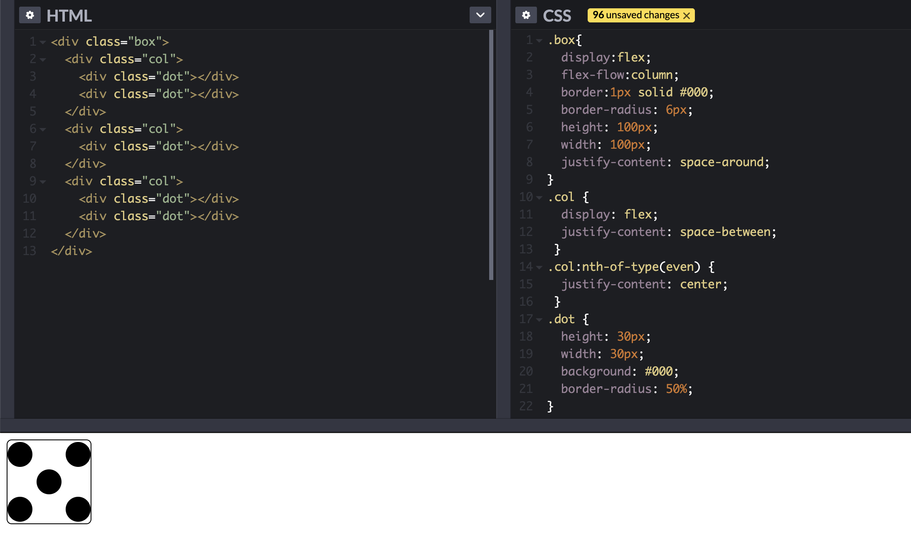

# ✨HTML

## viewport

```html
<meta viewport="width=device-width, initial-scale=1.0">
```

viewport的字段有width、height、initial-scale、maxinum-scale、minimum-scale、user-scalable，总共6个字段


# ✨CSS
## 布局
### flex

经典的题目就是用flex布局画一颗🎲啦。

### grid

也可以拿🎲来练手


### 响应式布局


## CSS3专题


# ✨JavaScript

# ✨网络通信

## Cookie

Cookie字段包括max-age（曾经是expires）、domain、path、secure、http-only

Cookie与本地存储的区别：

	- Cookie在旧版浏览器上单独域名下可能限制最多20个，新的浏览器则没限制数量；单个Cookie大小一般不超过4kB，因为是携带在请求头，如果体积过大，会对传输效率产生影响；Cookie得自己封装setCookie、getCookie、deleteCookie等方法；Cookie可以跨域
	- 本地存储包括localStorage和sessionStorage（IndexDB这里不谈）。它们俩没有大小限制，只能存储在本地，有getItem、setItem、clear等浏览器自带的方法


# ✨框架
## Vue
### computed与watch区别
- computed中名称不能与data里对象重复，只能用同步，必须return；多个值变化引起一个值变化，是多对一；
- watch里对象名称必须与data里对象一样，可以用异步，没有return；是一对多，监听一个值，引起多个值变化


## Vue跟React区别
直接引用[vue官网](https://cn.vuejs.org/v2/guide/comparison.html)的就好
**先说共同点：**

- 使用 Virtual DOM
- 提供了响应式 (Reactive) 和组件化 (Composable) 的视图组件。
- 将注意力集中保持在核心库，而将其他功能如路由和全局状态管理交给相关的库。

**再说区别：**

- 运行时性能：**优化方面**：在 React 应用中，当某个组件的状态发生变化时，它会以该组件为根，重新渲染整个组件子树。如要避免不必要的子组件的重渲染，你需要在所有可能的地方使用 `PureComponent`，或是手动实现 `shouldComponentUpdate` 方法。同时你可能会需要使用不可变的数据结构来使得你的组件更容易被优化。然而，使用 `PureComponent` 和 `shouldComponentUpdate` 时，需要保证该组件的整个子树的渲染输出都是由该组件的 props 所决定的。如果不符合这个情况，那么此类优化就会导致难以察觉的渲染结果不一致。这使得 React 中的组件优化伴随着相当的心智负担。在 Vue 应用中，组件的依赖是在渲染过程中自动追踪的，所以系统能精确知晓哪个组件确实需要被重渲染。你可以理解为每一个组件都已经自动获得了 `shouldComponentUpdate`，并且没有上述的子树问题限制。Vue 的这个特点使得开发者不再需要考虑此类优化，从而能够更好地专注于应用本身。

- HTML&CSS：

  **HTML：**

  在 React 中，所有的组件的渲染功能都依靠 JSX。JSX 是使用 XML 语法编写 JavaScript 的一种语法糖。Vue中一般会使用包括HTML、Script、Css的模板，然后把模板编译成相关js代码，上手难度是比react的JSX低的。

  > 更抽象一点来看，我们可以把组件区分为两类：一类是偏视图表现的 (presentational)，一类则是偏逻辑的 (logical)。我们推荐在前者中使用模板，在后者中使用 JSX 或渲染函数。这两类组件的比例会根据应用类型的不同有所变化，但整体来说我们发现表现类的组件远远多于逻辑类组件。

  **组件作用域的css：**

  CSS 作用域在 React 中是通过 CSS-in-JS 的方案实现的 (比如 [styled-components](https://github.com/styled-components/styled-components) 和 [emotion](https://github.com/emotion-js/emotion))。这引入了一个新的面向组件的样式范例，它和普通的 CSS 撰写过程是有区别的。另外，虽然在构建时将 CSS 提取到一个单独的样式表是支持的，但 bundle 里通常还是需要一个运行时程序来让这些样式生效。当你能够利用 JavaScript 灵活处理样式的同时，也需要权衡 bundle 的尺寸和运行时的开销。

  Vue 设置样式的默认方法是[单文件组件](https://cn.vuejs.org/v2/guide/single-file-components.html)里类似 `style` 的标签。

- 规模：

  - **向上拓展**：Vue 和 React 都提供了强大的路由来应对大型应用。React 社区在状态管理方面非常有创新精神 (比如 Flux、Redux)，而这些状态管理模式甚至 [Redux 本身](https://yarnpkg.com/en/packages?q=redux vue&p=1)也可以非常容易的集成在 Vue 应用中。Vue 的路由库和状态管理库都是由官方维护支持且与核心库同步更新的。React 则是选择把这些问题交给社区维护，因此创建了一个更分散的生态系统。但相对的，React 的生态系统相比 Vue 更加繁荣。Vue 提供了 [CLI 脚手架](https://github.com/vuejs/vue-cli)，能让你通过交互式的脚手架引导非常容易地构建项目。你甚至可以使用它[快速开发组件的原型](https://cli.vuejs.org/zh/guide/prototyping.html#快速原型开发)。React 在这方面也提供了 [create-react-app](https://github.com/facebookincubator/create-react-app)，但是现在还存在一些局限性。
  - **向下扩展**：React 学习曲线陡峭，在你开始学 React 前，你需要知道 JSX 和 ES2015，因为许多示例用的是这些语法。你需要学习构建系统，虽然你在技术上可以用 Babel 来实时编译代码，但是这并不推荐用于生产环境。Vue 向上扩展好比 React 一样，Vue 向下扩展后就类似于 jQuery。你只要把 min 版 Vue 标签放到页面就可以运行。

- 原生渲染：React Native VS Vue + Weex

  React Native 能使你用相同的组件模型编写有本地渲染能力的 APP (iOS 和 Android)。能同时跨多平台开发，对开发者是非常棒的。相应地，Vue 和 [Weex](https://weex.apache.org/) 会进行官方合作，Weex 是阿里巴巴发起的跨平台用户界面开发框架，同时也正在 Apache 基金会进行项目孵化，Weex 允许你使用 Vue 语法开发不仅仅可以运行在浏览器端，还能被用于开发 iOS 和 Android 上的原生应用的组件。


# ✨工程化
## webpack打包过程

# ✨性能
## 白屏问题


# ✨算法


## 树

层次遍历

```javascript
var tree = {
  val:1,
  left: {
      val: 2,
      left: null,
      right: null
  },
  right: {
      val:3,
      left: {
          val: 31
      },
      right:{
          val: 32
      }   
  }
}
// 迭代！ 时间复杂度O(n)，空间复杂度O(n)
var levelOrder = function(root) {
    let result = []
    if(!root) return result
  	// const res = [].push(root) 与 const res = [root] 与 下边的写法有什么区别？
    const res = []
    res.push(root)
    let level = 0
    while(res.length !== 0){
        result[level] = []
        const len = res.length
        // 注意，len要提出来，不能在下边循环体用res.length，你就在面试中犯了这个错误！太不应该了
        for(let i=0;i<len;i++){
            const item = res.shift()
            result[level].push(item.val)
            item.left && res.push(item.left)
            item.right && res.push(item.right)
        }
        level++
    }
    return result
};
levelOrder(tree)
// [[1],
// 	[2,3],
// 	[31,32]]
```

递归版本

