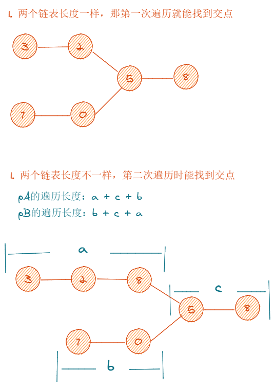

# ✨HTML

## viewport

```html
<meta viewport="width=device-width, initial-scale=1.0">
```

viewport的字段有width、height、initial-scale、maxinum-scale、minimum-scale、user-scalable，总共6个字段


# ✨CSS

## 布局
### flex

经典的题目就是用flex布局画一颗🎲啦。

### grid

也可以拿🎲来[练手](https://codepen.io/townivan/pen/vrxOYY)


### 响应式布局


## CSS3专题


# ✨JavaScript

# ✨网络通信

## Cookie

Cookie字段包括max-age（曾经是expires）、domain、path、secure、http-only

Cookie与本地存储的区别：

	- Cookie在旧版浏览器上单独域名下可能限制最多20个，新的浏览器则没限制数量；单个Cookie大小一般不超过4kB，因为是携带在请求头，如果体积过大，会对传输效率产生影响；Cookie得自己封装setCookie、getCookie、deleteCookie等方法；Cookie可以跨域
	- 本地存储包括localStorage和sessionStorage（IndexDB这里不谈）。它们俩没有大小限制，只能存储在本地，有getItem、setItem、clear等浏览器自带的方法


# ✨框架
## Vue
### computed与watch区别
- computed中名称不能与data里对象重复，只能用同步，必须return；多个值变化引起一个值变化，是多对一；
- watch里对象名称必须与data里对象一样，可以用异步，没有return；是一对多，监听一个值，引起多个值变化


### Vue跟React区别
直接引用[vue官网](https://cn.vuejs.org/v2/guide/comparison.html)的就好
**先说共同点：**

- 使用 Virtual DOM
- 提供了响应式 (Reactive) 和组件化 (Composable) 的视图组件。
- 将注意力集中保持在核心库，而将其他功能如路由和全局状态管理交给相关的库。

**再说区别：**

- 运行时性能：**优化方面**：在 React 应用中，当某个组件的状态发生变化时，它会以该组件为根，重新渲染整个组件子树。如要避免不必要的子组件的重渲染，你需要在所有可能的地方使用 `PureComponent`，或是手动实现 `shouldComponentUpdate` 方法。同时你可能会需要使用不可变的数据结构来使得你的组件更容易被优化。然而，使用 `PureComponent` 和 `shouldComponentUpdate` 时，需要保证该组件的整个子树的渲染输出都是由该组件的 props ÷所决定的。如果不符合这个情况，那么此类优化就会导致难以察觉的渲染结果不一致。这使得 React 中的组件优化伴随着相当的心智负担。在 Vue 应用中，组件的依赖是在渲染过程中自动追踪的，所以系统能精确知晓哪个组件确实需要被重渲染。你可以理解为每一个组件都已经自动获得了 `shouldComponentUpdate`，并且没有上述的子树问题限制。Vue 的这个特点使得开发者不再需要考虑此类优化，从而能够更好地专注于应用本身。

- HTML&CSS：

  **HTML：**

  在 React 中，所有的组件的渲染功能都依靠 JSX。JSX 是使用 XML 语法编写 JavaScript 的一种语法糖。Vue中一般会使用包括HTML、Script、Css的模板，然后把模板编译成相关js代码，上手难度是比react的JSX低的。

  > 更抽象一点来看，我们可以把组件区分为两类：一类是偏视图表现的 (presentational)，一类则是偏逻辑的 (logical)。我们推荐在前者中使用模板，在后者中使用 JSX 或渲染函数。这两类组件的比例会根据应用类型的不同有所变化，但整体来说我们发现表现类的组件远远多于逻辑类组件。

  **组件作用域的css：**

  CSS 作用域在 React 中是通过 CSS-in-JS 的方案实现的 (比如 [styled-components](https://github.com/styled-components/styled-components) 和 [emotion](https://github.com/emotion-js/emotion))。这引入了一个新的面向组件的样式范例，它和普通的 CSS 撰写过程是有区别的。另外，虽然在构建时将 CSS 提取到一个单独的样式表是支持的，但 bundle 里通常还是需要一个运行时程序来让这些样式生效。当你能够利用 JavaScript 灵活处理样式的同时，也需要权衡 bundle 的尺寸和运行时的开销。

  Vue 设置样式的默认方法是[单文件组件](https://cn.vuejs.org/v2/guide/single-file-components.html)里类似 `style` 的标签。

- 规模：

  - **向上拓展**：Vue 和 React 都提供了强大的路由来应对大型应用。React 社区在状态管理方面非常有创新精神 (比如 Flux、Redux)，而这些状态管理模式甚至 [Redux 本身](https://yarnpkg.com/en/packages?q=redux vue&p=1)也可以非常容易的集成在 Vue 应用中。Vue 的路由库和状态管理库都是由官方维护支持且与核心库同步更新的。React 则是选择把这些问题交给社区维护，因此创建了一个更分散的生态系统。但相对的，React 的生态系统相比 Vue 更加繁荣。Vue 提供了 [CLI 脚手架](https://github.com/vuejs/vue-cli)，能让你通过交互式的脚手架引导非常容易地构建项目。你甚至可以使用它[快速开发组件的原型](https://cli.vuejs.org/zh/guide/prototyping.html#快速原型开发)。React 在这方面也提供了 [create-react-app](https://github.com/facebookincubator/create-react-app)，但是现在还存在一些局限性。
  - **向下扩展**：React 学习曲线陡峭，在你开始学 React 前，你需要知道 JSX 和 ES2015，因为许多示例用的是这些语法。你需要学习构建系统，虽然你在技术上可以用 Babel 来实时编译代码，但是这并不推荐用于生产环境。Vue 向上扩展好比 React 一样，Vue 向下扩展后就类似于 jQuery。你只要把 min 版 Vue 标签放到页面就可以运行。

- 原生渲染：React Native VS Vue + Weex

  React Native 能使你用相同的组件模型编写有本地渲染能力的 APP (iOS 和 Android)。能同时跨多平台开发，对开发者是非常棒的。相应地，Vue 和 [Weex](https://weex.apache.org/) 会进行官方合作，Weex 是阿里巴巴发起的跨平台用户界面开发框架，同时也正在 Apache 基金会进行项目孵化，Weex 允许你使用 Vue 语法开发不仅仅可以运行在浏览器端，还能被用于开发 iOS 和 Android 上的原生应用的组件。


### Vue实现响应式

[官网](https://cn.vuejs.org/v2/guide/reactivity.html)，最好的解释

- **追踪变化**

当你把一个普通的JS对象传入Vue实例作为data选项，Vue将遍历此对象所有的property，并使用`Object.defineProperty`把这些property全部转为getter/setter。（`Object.defineProperty` 是 ES5 中一个无法 shim 的特性，这也就是 Vue 不支持 IE8 以及更低版本浏览器的原因。）这些 getter/setter 对用户来说是不可见的，但是在内部它们让 Vue 能够追踪依赖，在 property 被访问和修改时通知变更。每个组件实例都对应一个 **watcher** 实例，它会在组件渲染的过程中把“接触”过的数据 property 记录为依赖。之后当依赖项的 setter 触发时，会通知 watcher，从而使它关联的组件重新渲染。

- **异步更新**

Vue在更新DOM时是异步执行的。只要侦听到数据变化，Vue将开启一个队列，并缓冲在同一时间循环中发生的所有数据变更。如果同一个Watcher被多次触发，只会被推入到队列中一次。这种在缓冲时去除重复数据对于避免不必要的计算和DOM操作是非常重要的。然后，在下一个事件循环"tick"中，Vue刷新队列并执行实际（已去重）工作。Vue在内部对异步队列尝试使用原生的`Promise.then`、`MutationObserver` 和 `setImmediate`，如果执行环境不支持，则会采用 `setTimeout(fn, 0)` 代替。


### Vuex

单向数据流，是一种Flux的实现。组件不允许直接变更属于store实例的state，而应执行action来分发（dispatch）事件通知store去改变。（直接改store的数据是可以改的，但是控制台会报警告、vue调试工具也监测不到这变化。）这样约定的好处是，我们能够记录所有 store 中发生的 state 变更，同时实现能做到记录变更、保存状态快照、历史回滚/时光旅行的先进的调试工具。


### \<keep-alive\>

应该注意什么？

应该注意被切换的组件有自己的名称，无论是通过组件的`name`选项还是局部/全局注册


### 异步组件

Vue 允许你以一个**工厂函数**的方式定义你的组件，这个工厂函数会异步解析你的组件定义。Vue 只有在这个组件需要被渲染的时候才会触发该工厂函数，且会把结果**缓存**起来供未来重渲染。


### 如何实现组件懒加载？

结合 Vue 的[异步组件](https://cn.vuejs.org/v2/guide/components-dynamic-async.html#异步组件)和 Webpack 的[代码分割功能](https://doc.webpack-china.org/guides/code-splitting-async/#require-ensure-/)（[code-splitting](https://webpack.js.org/guides/code-splitting/)），轻松实现路由组件的懒加载

```javascript
// 首先，可以将异步组件定义为返回一个 Promise 的工厂函数 (该函数返回的 Promise 应该 resolve 组件本身)：
const Foo = () => Promise.resolve({ /* 组件定义对象 */ })
// 第二，在 Webpack 2 中，我们可以使用动态 import语法来定义代码分块点 (split point)：
import('./Foo.vue') // 返回 Promise

// 最后就长这样
const Foo = () => import('./Foo.vue')
```

懒加载带来的问题

- 懒加载的元素将会延迟加载，这里的延迟指的是会出现滞后于其他同步元素的出现，甚至会出现页面闪一下的过程
- 如果一个页面中有许多嵌套的懒加载组件，那么网页中的元素会分先后渲染，层次不齐


### Vue实现响应式的过程

当一个Vue实例创建时，Vue会遍历data选项的属性，用Object.defineProperty将它们转为getter/setter并且在内部追踪相关依赖，在属性被访问和修改时通知变化。每一个组件实例都有响应的watcher程序实例，它会在组件渲染过程中把属性记录为依赖，之后当依赖项的setter被调用时，会通知所有相关watch派发更新到相关联的组件。


### Vue diff算法

组件更新的过程核心就是新旧 vnode diff，对新旧节点相同以及不同的情况分别做不同的处理。新旧节点不同的更新流程是创建新节点->更新父占位符节点->删除旧节点；而新旧节点相同的更新流程是执行patchVnode，然后获取它们的 children，根据不同情况做不同的更新逻辑。最复杂的情况是新旧节点相同且它们都存在子节点，那么会执行 `updateChildren` 逻辑。

**sameVnode** 的逻辑非常简单，如果两个 vnode 的 key 不相等，则是不同的；否则继续判断对于同步组件，则判断 isComment、data、input 类型等是否相同，对于异步组件，则判断 asyncFactory 是否相同。


### Vue组件data为什么必须是函数

因为**组件是可以复用**的。也就是说会有多个组件实例同时存在，同时由于对象是引用类型，所以如果所有组件实例都共用一个data对象，那么一个组件对data进行修改，其他组件也受到影响。所以需要使用函数返回data对象的独立拷贝，使得每个对象实例都有自己的数据空间，相互之间独立、不受彼此影响，便于各自维护。


# ✨工程化

## webpack打包过程

新的描述方法：

1. 解析webpack配置参数：从webpack配置文件和shell命令行语句中合并并得到最终配置参数；
2. 用上一步得到的参数初始化Compiler实例，Compiler负责文件监听和启动编译。Compiler实例中包含完整地webpack配置。全局只有一个Compiler实例
3. 依次调用插件的apply方法，让插件可以监听后续所有事件节点。同时给插件传入Compiler实例的引用，方便插件通过Compiler调用webpack提供的api改变webpack的运行结果；
4. 从配置的入口entry开始解析文件构建AST树，找出每个文件所依赖的文件(模块，module)，递归直到确定完所有文件的依赖关系；
5. 递归完得到所有文件的依赖关系，根据entry配置生成代码块chunk
6. 将每个chunk转换成一个单独文件bunble加入到输出列表
7. 根据配置确定输出路径和文件名，将内容写到文件系统中

另外一种描述方法：

1.


# ✨性能
## 白屏问题


# ✨移动端
以下基本来自[这里](https://blog.csdn.net/sookielulu/article/details/113835526)

## 一般采用什么布局？设计稿一般多大尺寸

定宽布局；

640px和750px（iPhone6，dpr=2）。公司用750px。


## 自适应不同屏幕的几种方法

1. rem布局
2. flex布局
3. 百分比布局


## 移动端用过哪些meta标签

```html
<meta content="width=device-width,initial-scale=1.0,maximum-scale=1.0,user-scalable=0" name="viewport">
```
忽略将数字变为电话号码
```html
<meta content="telephone=no" name="format-detection">
```
忽略识别邮箱
```html
<meta content="email=no" name="format-detection">
```
IOS safari允许全屏浏览
```html
<meta content="yes" name="apple-mobile-web-app-capable">
```


## 300毫秒延迟

因为移动端浏览器会有一些默认行为，比如双击缩放、双指滚动。这些行为尤其是双击缩放，主要是为桌面网站在移动端的浏览体验设计的，而在用户对页面操作时，移动端浏览器会优先判断用户是否触发默认行为


## 点击穿透问题

> 问题点击穿透问题：点击蒙层（mask）上的关闭按钮，蒙层消失后发现触发了按钮下面元素的click事件

```
zepto的tap事件是绑定到document的，所以一般点击tap事件都会冒泡到document才会触发。当点击隐藏蒙层的时候默认也会手指触发到蒙层下面的元素执行事件
```

为了解决这问题，一般在移动端用touchstart、touchend、touchmove、tap来取代click时间

```js
//tap事件出现点透问题
$("#id").on("tap", function (event) {
  //很多处理比如隐藏什么的
  event.preventDefault();
});

//touchend事件解决点头问题
$("#id").on("touchend", function (event) {
  //很多处理比如隐藏什么的
  event.preventDefault();
});

```

或者使用FastClick库

> FastClick的实现原理是在检测到touchend事件的时候，会通过DOM自定义事件立即出发模拟一个click事件，并把浏览器在300ms之后的click事件阻止掉。


## 移动端横屏怎么处理

写好一套样式 **获取窗口的宽度大于高度**的时候说明横屏了 。那么就显示一个遮罩层**提示用户竖屏观看更佳**


## 移动端怎么横屏显示

1. 检测到手机竖屏的时候，给最上边元素加90deg旋转
2. 检测到横屏的时候，旋转角度改为0


## 在某些安卓设备下背景图片模糊的问题

设备像素比DPR的问题。安卓手机devicePixoRadio比较乱，有1.5的，有2的也有3的。想让图片在手机里显示更为清晰，必须使用2x的背景图来代替img标签（一般情况下都是2倍的），或者指定background-size:contain;都可以。

用-webkit-min-device-pixel-ratio可以做到不同倍数不同尺寸的图片：

```css
.icon-logo{
  background-image: url(src/assets/logo.png);
  width: 24px;
  height: 24px;
  background-size: contain;
}
@media screen and (-webkit-min-device-pixel-ratio: 2){
  .icon-logo {
    background-image: url(src/assets/logo@2.png); }
}
@media screen and (-webkit-min-device-pixel-ratio: 3){
	.icon-logo {
    background-image: url(src/assets/logo@3.png); }
}
@media screen and (-webkit-min-device-pixel-ratio: 4){
	.icon-logo { background-image: url(src/assets/logo@4.png); }
}
```


## **pc端与移动端字体大小的问题**

使用-webkit-text-size-adjust: 100%

```css
html,body,form,fieldset,p,div,h1,h2,h3,h4,h5,h6{
	-webkit-text-size-adjust:100%;
}
```


## **解决上下拉动滚动条时出现卡顿的现象**

Android3+和iOSi5+

```css
body{
	-webkit-overflow-scrolling:touch;
	overflow-scrolling:touch;
}
```


## 解决长时间按住页面闪退的现象

```css
element {
  -webkit-touch-callout: none
}
```


## 1px边框问题

依旧是DPR问题

- 使用媒体查询

- 使用border-image

  ```css
  .border-image-1px {
      border-width: 1px 0px;
      -webkit-border-image: url("border.png") 2 0 stretch;
      border-image: url("border.png") 2 0 stretch;
  }
  ```

- 使用viewport + rem

  设置meta标签

  ```html
  <meta id=“WebViewport” content="width=device-width,initial-scale=1.0,maximum-scale=1.0,user-scalable=0" name="viewport">
  ```

  然后使用js判断是几倍屏

  ```js
  function rem = () => {
    document.documentElement.style.fontSize = document.documentElement.clientWidth/7.5 + 'px'
    let viewport = document.queryElementById('WebViewport')
    if (window.devicePixelRatio == 1) {
      viewport.setAttribute('content', 'width=device-width, initial-scale=1, maximum-scale=1, minimum-scale=1, user-scalable=no')} 
  
    if (window.devicePixelRatio == 2) {
        viewport.setAttribute('content', 'width=device-width, initial-scale=0.5, maximum-scale=0.5, minimum-scale=0.5, user-scalable=no')}
  
    if (window.devicePixelRatio == 3) {
        viewport.setAttribute('content', 'width=device-width, initial-scale=0.333333333, maximum-scale=0.333333333, minimum-scale=0.333333333, user-scalable=no')}
  }
  window.onresize = rem
  rem() // 触发resize
  ```

- 通过引入**border.css**第三方库解决


## JsBridge


# ✨算法


## 树

层次遍历

```javascript
var tree = {
  val:1,
  left: {
      val: 2,
      left: null,
      right: null
  },
  right: {
      val:3,
      left: {
          val: 31
      },
      right:{
          val: 32
      }   
  }
}
// 迭代！ 时间复杂度O(n)，空间复杂度O(n)
var levelOrder = function(root) {
    let result = []
    if(!root) return result
  	// const res = [].push(root) 与 const res = [root] 与 下边的写法有什么区别？
    const res = []
    res.push(root)
    let level = 0
    while(res.length !== 0){
        result[level] = []
        const len = res.length
        // 注意，len要提出来，不能在下边循环体用res.length，你就在面试中犯了这个错误！太不应该了
        for(let i=0;i<len;i++){
            const item = res.shift()
            result[level].push(item.val)
            item.left && res.push(item.left)
            item.right && res.push(item.right)
        }
        level++
    }
    return result
};
levelOrder(tree)
// [[1],
// 	[2,3],
// 	[31,32]]
```

递归版本


## 链表

### 环形链表II：求环的入口（也是求柄的长度）

> 给定一个链表，返回链表开始入环的第一个节点。 如果链表无环，则返回 null。
>
> 为了表示给定链表中的环，我们使用整数 pos 来表示链表尾连接到链表中的位置（索引从 0 开始）。 如果 pos 是 -1，则在该链表中没有环。注意，pos 仅仅是用于标识环的情况，并不会作为参数传递到函数中。
>


```js
var detectCycle = function(head) {
    let slow = head, fast = head
    while(fast && fast.next){
      slow = slow.next
      fast = fast.next.next
      // 注意下边不是slow.val跟fast.val对比
      if(slow === fast){
        fast = head
        while(fast !== slow){
          slow = slow.next
          fast = fast.next
        }
        return slow
      }
    }
  return null
};
```


### 环形链表III：求环的长度

先保证有环，然后让快慢指针相遇，之后继续快2慢1的速度走，直到再次相遇，慢指针所走的长度即为环的长度

```js
var detectCycle = function(head) {
    let slow = head, fast = head
    while(fast && fast.next){
      slow = slow.next
      fast = fast.next.next
      // 注意下边不是slow.val跟fast.val对比
      if(slow === fast){
        let res = 0
        while(fast !== slow){
          slow = slow.next
          fast = fast.next.next
          res++
        }
        return res
      }
    }
  return null
};
```


### 环形链表IV：求带环链表长度

求出柄长+环长，即为环形链表的长度


### 相交链表

```js
var getIntersectionNode = function (headA, headB) {
    if (!headA || !headB) return null;

    let pA = headA,
        pB = headB;
    while (pA !== pB) {
        pA = pA === null ? headB : pA.next;
        pB = pB === null ? headA : pB.next;
    }
    return pA;
};
```

如果链表有交点：

1. 如果长度一样，那么第一次遍历就能找到相交的点；

2. 如果不一样，那么第二次遍历也能找到交点；

   

如果没有交点：

1. 如果长度一样，第一次遍历最后都是null，测试AB指针相等，直接结束循环，返回null；
2. 如果不一样，最后第二次遍历也会到达null，返回null

​	